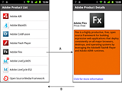

# Getting started with mobile applications

Adobe Flex brings Flex and Adobe Flash Builder to smartphones and tablets.
Leveraging Adobe AIR, you can now develop mobile applications in Flex with the
same ease and quality as on desktop platforms.

Many existing Flex components have been extended to work on mobile devices,
including the addition of support for touch-based scrolling. Flex also contains
a set of new components designed to make it easy to build applications that
follow standard design patterns for phones and tablets.

Flash Builder has also been updated to add new features to support application
development for mobile devices. With Flash Builder, you can develop, test, and
debug applications on the desktop, or directly on your mobile device.

## Adobe recommends

> ###  [Adobe TV: Build your first mobile application in Flash Builder](https://web.archive.org/web/20130209061042/http://tv.adobe.com/watch/adc-presents/build-your-first-mobile-application-in-flash-builder-45/t) <a
>
> [Serge Jespers](https://web.archive.org/web/20150219043724mp_/http://www.webkitchen.be/)
>
> Build and deploy mobile apps in just a few minutes with Flash Builder.

 Adobe Evangelist Mark Doherty posted a video about
[building applications for the desktop, mobile phones, and tablets](https://web.archive.org/web/20120612204637/http://tv.adobe.com/watch/adc-presents/applications-for-the-web-desktop-and-mobile/).

 Adobe Evangelist James Ward posted a video about
[Building Mobile Apps with Flex](https://www.youtube.com/watch?v=RAjbzIYlKGo).

 Adobe Community Professional Joseph Labrecque
[blogged about a Mobile Flex Demonstration](https://www.youtube.com/watch?v=GApgmkH7vR8).

 Flash developer Fabio Biondi
[created an AIR-based YouTube Player for Android devices using Flash Builder](https://web.archive.org/web/20130207160626/http://www.fabiobiondi.com/blog/2011/04/create-a-youtube-player-for-android-using-flash-builder-45/).

## Adobe recommends

> ###  [Mobile development using Adobe Flex SDK and Flash Builder](https://web.archive.org/web/20130209104903/http://www.adobe.com/devnet/flex/articles/mobile-development-flex-flashbuilder.html)
>
> [NJ](https://web.archive.org/web/20150219043724mp_/http://www.rictus.com/muchado/)
>
> Adobe Product Designer NJ helps you create the TwitterTrends mobile
> application.

> ###  [Flash Builder - Mobile Highlights](https://web.archive.org/web/20130119045350/http://devgirl.org/2011/04/11/flash-builder-4-5-mobile-highlights/)
>
> [Holly Schinsky](https://web.archive.org/web/20160421170838/http://devgirl.org/)
>
> Holly Schinsky guides you through Flash Builder mobile highlights.

## Design a mobile application

Because of the smaller screen sizes available on mobile devices, mobile
applications typically follow different design patterns from browser-based
applications. When developing for mobile applications, you typically divide the
content into a series of views for display on a mobile device.

Each view contains components that are focused on a single task or that contain
a single set of information. The user typically "drills down", or changes, from
one view to another by tapping components in the view. The user can then use the
device's back button to return to a previous view, or build navigation into the
application.

In the following example, the initial view of the application shows a list of
products:

A. Select a list item to change views in the application. B. Use the device's
back button to return to the previous view.

The user selects a product in the list to obtain more information. The selection
changes view to a detailed description of the product.

If you are designing an application for mobile, web, and desktop platforms, you
typically design separate user interfaces for each platform. However, the
applications can share any underlying model and data access code across all
platforms.

## Build applications for phones and tablets

For a tablet application, you are not as concerned with screen size limits as
you are with phones. You do not have to structure a tablet application around
small views. Instead, you can build your application using the standard Spark
Application container with the supported mobile components and skins.

> **Note:** You can create an application for a mobile phone based on the Spark
> Application container. However, you typically use the ViewNavigatorApplication
> and TabbedViewNavigatorApplication containers instead.

Create a mobile project in Flash Builder for tablets just as you do for phones.
Tablet and phone applications require the same mobile theme to benefit from the
components and skins optimized for mobile applications.

## Author mobile applications in Flash Builder

Flash Builder brings a productive design, build, and debug workflow to mobile
development. The goal of the mobile features in Flash Builder is to make it as
easy to develop an ActionScript- or Flex-based mobile application as it is to
develop a desktop or web application.

Flash Builder offers two options for testing and debugging. You can launch and
debug the application on the desktop using the AIR Debug Launcher (ADL). For
greater control, launch and debug the application directly on a mobile device.
In either case, you can use the Flash Builder debugging capabilities, including
setting breakpoints and examining the application's state using the Variables
and Expressions panels.

When your application ready for deployment, use the Export Release Build
process, just as you would to prepare desktop and web applications. The main
difference is that when you export a release build of a mobile project, Flash
Builder packages the build as a native installer, not as an .air file. For
example, on Android, Flash Builder produces an .apk file that looks the same as
a native Android application package. The native installer enables AIR-based
applications to be distributed the same way as native applications on each
platform.

## Deploy mobile applications in AIR

Deploy mobile applications built in Flex using Adobe AIR for mobile devices. Any
device on which you want to deploy a mobile application must support AIR.

Your applications can take full advantage of the integration of AIR with the
mobile platform. For example, a mobile application can handle a hardware back
and menu button, and access local storage. You can also take advantage of all
features that AIR offers for mobile devices. These features include geolocation,
accelerometer, and camera integration.

On a mobile device, it is not necessary to install AIR before you run an
application built in Flex. The first time a user runs an application built in
Flex, the user is prompted to download AIR.

To familiarize yourself with AIR, and for more information on the capabilities
of AIR, see the following:

- [About Adobe AIR](https://web.archive.org/web/20150908010859/http://help.adobe.com/en_US/air/build/WS5b3ccc516d4fbf351e63e3d118666ade46-7fc4.html)

- [AIR application invocation and termination](https://web.archive.org/web/20151113163417/http://help.adobe.com/en_US/as3/dev/WS5b3ccc516d4fbf351e63e3d118676a5d46-8000.html)

- [Working with AIR runtime and operating system information](https://web.archive.org/web/20151025153152/http://help.adobe.com/en_US/as3/dev/WS5b3ccc516d4fbf351e63e3d118676a5f3b-8000.html)

- [Working with AIR native windows](https://web.archive.org/web/20151021214030/http://help.adobe.com/en_US/as3/dev/WS5b3ccc516d4fbf351e63e3d118666ade46-7e17.html)

- [Working with local SQL databases in AIR](https://web.archive.org/web/20151118052500/http://help.adobe.com/en_US/as3/dev/WS5b3ccc516d4fbf351e63e3d118676a5497-7fb4.html)

When developing mobile applications, you cannot use the following Flex
components for AIR: WindowedApplication and Window. Instead, use the
ViewNavigatorApplication and TabbedViewNavigatorApplication containers. When
developing mobile applications for tablets, you can also use the Spark
Application container.

For more information, see
[Using the Flex AIR components](https://web.archive.org/web/20150219043724mp_/http://help.adobe.com/en_US/flex/using/WSacd9bdd0c5c09f4a-690d4877120e8b878b0-8000.html)
and
[Define a mobile application and a splash screen](../user-interface-and-layout/define-a-mobile-application-and-a-splash-screen.md).

## Use the Mobile theme in your application

A _theme_ defines the look and feel of an application's visual components. A
theme can define something as simple as the color scheme or common font for an
application, or it can define a complete reskinning of all the components used
by the application.

You can set CSS styles on Flex components only if the current theme includes
those styles. To determine if the current theme supports the CSS style, view the
style's entry in
[ActionScript 3.0 Reference for the Adobe Flash Platform](https://help.adobe.com/en_US/FlashPlatform/reference/actionscript/3/index.html).

Flex supports three primary themes: Mobile, Spark, and Halo. The Mobile theme
defines the default appearance of Flex components when you create a mobile
application. To make some Flex components compatible with the Mobile theme,
Adobe created new skins for the components. Therefore, some components have
skins specific to a theme.

Applications built with Flex can target different mobile devices, each with
different screen sizes and resolutions. Flex simplifies the process of producing
resolution-independent applications by providing DPI-independent skins for
mobile components. For more information on mobile skins, see
[Basics of mobile skinning](../skinning/basics-of-mobile-skinning.md).

For more information about styles and themes, see
[Styles and themes](https://web.archive.org/web/20150219043724mp_/http://help.adobe.com/en_US/flex/using/WS2db454920e96a9e51e63e3d11c0bf69084-7fee.html)
and [Mobile styles](../skinning/basics-of-mobile-skinning.md#mobile-styles).

## Community resources

Read about the new features in Flex and Flash Builder in:

- [Introducing Adobe Flex SDK](https://web.archive.org/web/20150227103243mp_/http://www.adobe.com/devnet/flex/articles/introducing-flex45sdk.html)
  by Adobe Product Manager, Deepa Subramaniam

- [Mobile development using Adobe Flex SDK and Flash Builder](https://web.archive.org/web/20130209104903/http://www.adobe.com/devnet/flex/articles/mobile-development-flex-flashbuilder.html)
  by Adobe Product Designer, Narciso Jaramillo.

- [What's new in Flex 4.6 SDK](https://web.archive.org/web/20150430091327/http://www.adobe.com/devnet/flex/articles/introducing-flex46sdk.html)
  by Adobe Product Manager Jacob Surber and
  [What's New in Flash Builder 4.6](https://web.archive.org/web/20150519124522/http://www.adobe.com/devnet/flash-builder/articles/whatsnew-flashbuilder-46.html)
  by Adobe Product Manager Adam Lehman.

The
[Flex Developer Center](https://web.archive.org/web/20150916021929/http://www.adobe.com/devnet/flex.html)
contains many resources that can help you start building mobile applications
using Flex:

- Getting Started articles, links, and tutorials

- Samples of real applications built in Flex

- The
  [Flex Cookbook](https://web.archive.org/web/20150219043724mp_/http://cookbooks.adobe.com/flex),
  which contains answers to common coding problems

- Links to the Flex community and to other sites devoted to Flex

Another resource is
[Adobe TV](https://web.archive.org/web/20151111152356/http://tv.adobe.com/product/flex/),
which contains videos by Adobe engineers, product evangelists, and customers
about application development in Flex. One of the videos available is
[Build your first mobile application in Flash Builder](https://web.archive.org/web/20151121212920/http://tv.adobe.com/watch/adc-presents/build-your-first-mobile-application-in-flash-builder-45/).
