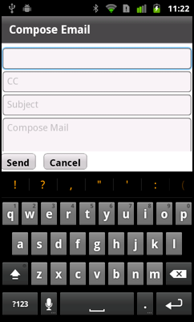

# Use the soft keyboard in a mobile application

Many devices do not include a hardware keyboard. Instead, these devices use a
keyboard that opens on the screen when necessary. The soft keyboard, also called
a screen or virtual keyboard, closes after the user enters information, or when
the user cancels the operation.

The following figure shows an application using the soft keyboard:

The soft keyboard has a different sets of features, based on the component that
raises it:

- Native features: The keyboard that is used with the default text input
  controls TextArea and TextInput hooks into the native interface for features
  such as auto-correction, auto-completion, and custom keyboard layouts. Support
  for the full set of features is built into the default StageText-based skin
  classes of the text input controls. Not all devices support all native
  features.

- Limited: The keyboard that is used with any control other than TextArea and
  TextInput, or with TextArea and TextInput when they use TextField-based skins.
  The limited feature set does not support native OS features such as
  auto-correction, auto-completion, and custom keyboard layouts.

Because the keyboard takes up part of the screen, Flex must ensure that an
application still functions in the reduced screen area. For example, the user
selects a TextInput control, causing the soft keyboard to open. After the
keyboard opens, Flex automatically resizes the application to the available
screen area. Flex can then reposition the selected TextInput control so that it
is visible above the keyboard.

 Blogger Peter Elst
[blogged about controlling the soft keyboard in Flex Mobile applications](https://web.archive.org/web/20150214003833mp_/http://www.peterelst.com/blog/2011/05/08/controlling-the-soft-keyboard-in-flex-mobile-applications/).

## Open a soft keyboard in a mobile Flex application

There are three ways to open a soft keyboard in a mobile application:

- Focus on a control with a text input control such as
  [TextInput](https://help.adobe.com/en_US/FlashPlatform/reference/actionscript/3/spark/components/TextInput.html)
  or
  [TextArea](https://help.adobe.com/en_US/FlashPlatform/reference/actionscript/3/spark/components/TextArea.html)

- Set a control's `needsSoftKeyboard` property to `true` and set focus on that
  control

- Call the `requestSoftKeyboard()` method on a control (not on iOS)

The keyboard stays open until one of the following actions occurs:

- The user moves focus to a control that does not receive text input. This can
  happen when the user manually points to another text input control, or if the
  user presses the return key on the keyboard and the application moves the
  focus to another control.

  If focus moves to another text input control, or to a control with
  `needsSoftKeyboard` set to `true`, the keyboard stays open.

- The user cancels input by pressing the back button on the device.

- You programmatically change focus to a non-interactive control or set
  `stage.focus` to `null`.

**Present a user with a text input control**

If you present a user with a text input control, a soft keyboard appears when
the user focuses on that control unless the `editable` property is set to
`false`.

The default behavior of the TextInput and TextArea controls is to use the
[StageText](https://help.adobe.com/en_US/FlashPlatform/reference/actionscript/3/flash/text/StageText.html)
class for rendering text. As a result, the keyboard that is displayed for these
controls supports native features such as auto-correction, auto-capitalization,
and keyboard types. Not all features are supported on all devices.

If you change the skin classes to use the
[TextField](https://help.adobe.com/en_US/FlashPlatform/reference/actionscript/3/flash/text/TextField.html)-based
skins for the text input controls, then the features are limited. The keyboard
itself is the same, but it does not support the native features.

**Set the `needsSoftKeyboard` property**

You can configure non-input controls to open the soft keyboard, such as a Button
or ButtonBar control. To open the keyboard when a control other than a text
input control receives focus, set the control's `needsSoftKeyboard` property to
`true`. All Flex components inherit this property from the
[InteractiveObject](https://help.adobe.com/en_US/FlashPlatform/reference/actionscript/3/flash/display/InteractiveObject.html)
class.

The keyboard that opens for any control other than TextInput and TextArea does
not support the native features such as auto-capitalization, auto-correction,
and customizable keyboard types.

> **Note:** The text input controls always open the keyboard when receiving
> focus. They ignore the `needsSoftKeyboard` property, and setting it has no
> effect on the text input controls.

**Call the `requestSoftKeyboard()` method**

To programmatically raise a soft keyboard, you can call the
`requestSoftKeyboard()` method. The object that calls this method must also have
the `needsSoftKeyboard` property set to `true`. This method changes focus to the
object that called the method and raises a soft keyboard if the device does not
have a hardware keyboard.

The
[InteractiveObject](https://help.adobe.com/en_US/FlashPlatform/reference/actionscript/3/flash/display/InteractiveObject.html)
class defines the `requestSoftKeyboard()` method. As a result, you can call this
method on any component that is a subclass of InteractiveObject.

If you call the `requestSoftKeyboard()` method on the TextArea or TextInput
control, then the native keyboard features such as auto-correction and
auto-capitalization are supported (if the device supports them).

The `requestSoftKeyboard()` method does not work on iOS devices.

## Use native features with a soft keyboard

The
[StageTextInputSkin](https://help.adobe.com/en_US/FlashPlatform/reference/actionscript/3/spark/skins/mobile/StageTextInputSkin.html)
and
[StageTextAreaSkin](https://help.adobe.com/en_US/FlashPlatform/reference/actionscript/3/spark/skins/mobile/StageTextAreaSkin.html)
classes define the skins for the
[TextInput](https://help.adobe.com/en_US/FlashPlatform/reference/actionscript/3/spark/components/TextInput.html)
and
[TextArea](https://help.adobe.com/en_US/FlashPlatform/reference/actionscript/3/spark/components/TextArea.html)
controls in a mobile application. These skins use the
[StageText](https://help.adobe.com/en_US/FlashPlatform/reference/actionscript/3/flash/text/StageText.html)
class to render text and hook into the native features of the soft keyboard.
These features include:

- Auto-correction

- Auto-capitalization

- Custom return key labels

- Custom keyboard types

Text input controls can also use the
[TextField](https://help.adobe.com/en_US/FlashPlatform/reference/actionscript/3/flash/text/TextField.html)-based
skins for text rendering. These skins do not support the native features. They
do, however, provide additional functionality for the underlying text control
such as support for scrolling forms, embedding fonts, access to the `keyUp` and
`keyDown` events, clipping, text measurement, and fractional alpha values.

To use the TextField-based skins, set the text input control's `skinClass`
property to point to the
[TextInputSkin](https://help.adobe.com/en_US/FlashPlatform/reference/actionscript/3/spark/skins/mobile/TextInputSkin.html)
and
[TextAreaSkin](https://help.adobe.com/en_US/FlashPlatform/reference/actionscript/3/spark/skins/mobile/TextAreaSkin.html)
classes. For example:

    <s:TextInput skinClass="spark.skins.mobile.TextInputSkin"/>
    <s:TextArea skinClass="spark.skins.mobile.TextAreaSkin"/>

### Use auto-correction for soft keyboards in a Flex mobile application

Auto-correction is a behavior of the OS that attempts to fix spelling mistakes
and apply predictive typing to a user's input. Depending on the device, the
behavior can be implemented as a bubble over the text, an extension of the soft
keyboard, or in some other way.

You can use auto-correction for soft keyboards in a mobile application by
setting the text input control's `autoCorrect` property to `true`. This is the
default value.

The following example lets you toggle auto-correction on and off:

    <?xml version="1.0" encoding="utf-8"?>
    <!-- mobile_keyboard/views/AutoCorrectionExample.mxml -->
    <s:View xmlns:fx="http://ns.adobe.com/mxml/2009"
    		xmlns:s="library://ns.adobe.com/flex/spark" title="Auto-Correction">
    	<fx:Declarations>
    		<!-- Place non-visual elements (e.g., services, value objects) here -->
    	</fx:Declarations>

    	<s:layout>
    		<s:VerticalLayout/>
    	</s:layout>

    	<s:TextInput prompt="Enter your text" autoCorrect="{myCB.selected}"/>
    	<s:CheckBox id="myCB" label="Enable auto-correct" enabled="true"/>

    </s:View>

Not all devices support auto-correction. If you enable or disable the
`autoCorrect` property on a device that does not support it, the runtime ignores
the value and uses the device's default behavior.

### Use auto-capitalization for soft keyboards in a Flex mobile application

Auto-capitalization is a setting that instructs the text input control to
capitalize certain words or letters when the user enters text. For example, you
can have all letters capitalized, or you can have just the first word of each
sentence capitalized automatically. It is a convenience for the user to not have
to worry about capitalization while entering text in a mobile application.

You use auto-capitalization in soft keyboards by setting the value of the
`autoCapitalize` property on the text input control. The possible values are
`none`, `word`, `sentence`, and `all`. The
[AutoCapitalize](https://help.adobe.com/en_US/FlashPlatform/reference/actionscript/3/flash/text/AutoCapitalize.html)
class defines the possible values. The default value is `none`.

The following example lets you select different values for auto-capitalization:

    <?xml version="1.0" encoding="utf-8"?>
    <!-- mobile_keyboard/views/AutoCapitalizeExample.mxml -->
    <s:View xmlns:fx="http://ns.adobe.com/mxml/2009"
    		xmlns:s="library://ns.adobe.com/flex/spark" title="Auto-Capitalization">
    	<fx:Declarations>
    		<!-- Place non-visual elements (e.g., services, value objects) here -->
    	</fx:Declarations>

    	<s:layout>
    		<s:VerticalLayout/>
    	</s:layout>

    	<s:Label text="Select a capitalization setting:"/>
    	<s:SpinnerListContainer>
    		<s:SpinnerList id="capTypeList" width="300" labelField="name" fontSize="12">
    			<s:ArrayCollection>
    				<fx:Object name="All" value="all"/>
    				<fx:Object name="None" value="none"/>
    				<fx:Object name="Sentence" value="sentence"/>
    				<fx:Object name="Word" value="word"/>
    			</s:ArrayCollection>
    		</s:SpinnerList>
    	</s:SpinnerListContainer>

    	<s:TextInput autoCapitalize="{capTypeList.selectedItem.value}"/>

    </s:View>

Not all devices support auto-capitalization. If you set the value of the
`autoCapitalize` property on a device that does not support it, the runtime
ignores the value and uses the device's default.

### Change soft keyboard types in a Flex mobile application

The
[SoftKeyboardType](https://help.adobe.com/en_US/FlashPlatform/reference/actionscript/3/flash/text/SoftKeyboardType.html)
class defines the types of soft keyboards for mobile applications. You select
the keyboard type with the `softKeyboardType` property on the text input
control.

The differences among most of the keyboards such as `email` and `contact` are
only slight. For example, the `email` keyboard presents the user with all the
same keys as the `contact` keyboard, except replaces the microphone with the "@"
symbol. The `url` keyboard uses the "/" symbol. The exception to this is the
`number` keyboard. This keyboard looks like a calculator screen with a focus on
numbers and operators.

The following example shows the different types of soft keyboards that are
available:

    <?xml version="1.0" encoding="utf-8"?>
    <!-- mobile_keyboard/views/KeyboardTypes.mxml -->
    <s:View xmlns:fx="http://ns.adobe.com/mxml/2009"
    		xmlns:s="library://ns.adobe.com/flex/spark" title="Keyboard Types">
    	<fx:Declarations>
    		<!-- Place non-visual elements (e.g., services, value objects) here -->
    	</fx:Declarations>

    	<s:layout>
    		<s:VerticalLayout/>
    	</s:layout>

    	<s:Label text="Select a keyboard type:"/>
    	<s:SpinnerListContainer>
    		<s:SpinnerList id="keyboardTypeList" width="300" labelField="name">
    			<s:ArrayCollection>
    				<fx:Object name="Contact" value="contact"/>
    				<fx:Object name="Default" value="default"/>
    				<fx:Object name="Email" value="email"/>
    				<fx:Object name="Number" value="number"/>
    				<fx:Object name="Punctuation" value="punctuation"/>
    				<fx:Object name="URL" value="url"/>
    			</s:ArrayCollection>
    		</s:SpinnerList>
    	</s:SpinnerListContainer>

    	<s:TextInput softKeyboardType="{keyboardTypeList.selectedItem.value}" text=""/>

    </s:View>

Not all soft keyboard types are supported on all devices. If you specify a type
that is not supported, then the runtime ignores the value and uses the device's
default.

### Change return key labels on a soft keyboard in a Flex mobile application

When the soft keyboard pops up and a user enters text, there must be a way for
the user to indicate that they are done and that they want to move to the next
field or submit the entered data. On a soft keyboard, this is usually
accomplished with the "return" key. This key does not enter a character in the
text input, but rather signals to the text input control that the user is done
entering text.

The
[ReturnKeyLabel](https://help.adobe.com/en_US/FlashPlatform/reference/actionscript/3/flash/text/ReturnKeyLabel.html)
class defines the possible labels for the return key. The possible values are
`default`, `done`, `go`, `next`, and `search`. You specify the return key label
with the `returnKeyLabel` property on the text input control.

The following example lets you select different return key labels:

    <?xml version="1.0" encoding="utf-8"?>
    <!-- mobile_keyboard/views/ReturnKeyLabels.mxml -->
    <s:View xmlns:fx="http://ns.adobe.com/mxml/2009"
    		xmlns:s="library://ns.adobe.com/flex/spark" title="Return Key Labels">
    	<fx:Declarations>
    		<!-- Place non-visual elements (e.g., services, value objects) here -->
    	</fx:Declarations>

    	<s:layout>
    		<s:VerticalLayout/>
    	</s:layout>

    	<s:Label text="Select a return key label:"/>
    	<s:SpinnerListContainer>
    		<s:SpinnerList id="returnKeyLabelList" width="300" labelField="name">
    			<s:ArrayCollection>
    				<fx:Object name="Default" value="default"/>
    				<fx:Object name="Done" value="done"/>
    				<fx:Object name="Go" value="go"/>
    				<fx:Object name="Next" value="next"/>
    				<fx:Object name="Search" value="search"/>
    			</s:ArrayCollection>
    		</s:SpinnerList>
    	</s:SpinnerListContainer>

    	<s:TextInput returnKeyLabel="{returnKeyLabelList.selectedItem.value}" text=""/>

    </s:View>

There is no difference in events or interaction among the different return key
types. Changing the `returnKeyLabel` property only changes the label of the key.

Not all devices support setting the label of the return key. If you set the
value of the `returnKeyLabel` property on a device that does not support it,
then the runtime ignores the value and uses the device's default.

## Use events with a soft keyboard in a mobile application

Interacting with a soft keyboard on a mobile device is not the same as
interacting with the keyboard in a desktop or web-based application. The
following table lists the events that are related to working with soft
keyboards:

<table>
<colgroup>
<col style="width: 50%" />
<col style="width: 50%" />
</colgroup>
<thead>
<tr class="header">
<th>
Event
</th>
<th>
When dispatched
</th>
</tr>
</thead>
<tbody>
<tr class="odd">
<td>
<samp>enter</samp>
</td>
<td>
When the user presses the return key.
</td>
</tr>
<tr class="even">
<td>
<samp>keyDown</samp> and <samp>keyUp</samp>
</td>
<td>
For the StageText-based skins, when only some keys are pressed
and released. For the TextField-based skins, when all keys are pressed
and released.

These events are not dispatched for all keys on all devices. Do not
rely on these methods for capturing key input with soft keyboards unless
you are using the TestField-based skins for controls that raise the
keyboard.
</td>
</tr>
<tr class="odd">
<td>
<samp>softKeyboardActivating</samp>
</td>
<td>
Just before the keyboard opens.
</td>
</tr>
<tr class="even">
<td>
<samp>softKeyboardActivate</samp>
</td>
<td>
Just after the keyboard opens.
</td>
</tr>
<tr class="odd">
<td>
<samp>softKeyboardDeactivate</samp>
</td>
<td>
After the keyboard closes.
</td>
</tr>
</tbody>
</table>

To determine when a user is done with the soft keyboard, you can listen for the
`FlexEvent.ENTER` event on the text input control. The control dispatches this
event when the return key is pressed. By listening for the `enter` event, you
can perform validation, change focus, or perform other operations on the
recently entered text.

In some cases, the `enter` event is not dispatched. This limitation appears on
Android devices when you use a soft keyboard on the last text input control on
the view. To work around this issue, set the `returnKeyLabel` property to `go`,
`next`, or `search` on the last text input control on the view.

The following example changes focus from one field to the next when the user
presses the "Next" key on the soft keyboard:

    <?xml version="1.0" encoding="utf-8"?>
    <!-- mobile_keyboard/views/UseNextLikeTab.mxml -->
    <s:View xmlns:fx="http://ns.adobe.com/mxml/2009"
    		xmlns:s="library://ns.adobe.com/flex/spark" title="Change Focus">
    	<fx:Declarations>
    		<!-- Place non-visual elements (e.g., services, value objects) here -->
    	</fx:Declarations>

    	<s:layout>
    		<s:VerticalLayout paddingTop="10" paddingLeft="10" paddingRight="10"/>
    	</s:layout>

    	<fx:Script>
    		<![CDATA[
    			private function changeField(ti:TextInput):void {
    				// Before changing focus to a new control, set the stage's focus to null:
    				stage.focus = null;

    				// Set focus on the TextInput that was passed in:
    				ti.setFocus();
    			}
    		]]>
    	</fx:Script>

    	<s:HGroup>
    		<s:Label text="1:" paddingTop="15"/>
    		<s:TextInput id="ti1" prompt="First Name"
    					 width="80%"
    					 returnKeyLabel="next"
    					 enter="changeField(ti2)"/>
    	</s:HGroup>
    	<s:HGroup>
    		<s:Label text="2:" paddingTop="15"/>
    		<s:TextInput id="ti2" prompt="Middle Initial"
    					 width="80%"
    					 returnKeyLabel="next"
    					 enter="changeField(ti3)"/>
    	</s:HGroup>
    	<s:HGroup>
    		<s:Label text="3:" paddingTop="15"/>
    		<s:TextInput id="ti3" prompt="Last Name"
    					 width="80%"
    					 returnKeyLabel="next"
    					 enter="changeField(ti1)"/>
    	</s:HGroup>

    </s:View>

When the user interacts with the default soft keyboard for the TextInput and
TextArea controls, the `keyUp` and `keyDown` events are dispatched only for a
small subset of keys. To capture individual keypresses for all keys, use the
`change` event. The `change` event is dispatched whenever the content of the
text input control changes. The disadvantage of this is that you do not have
access to properties of the key that was pressed and you must write your own
keypress logic.

The following example displays the character code of the last key pressed:

    <?xml version="1.0" encoding="utf-8"?>
    <!-- mobile_keyboard/views/CompareMobileKeyPresses.mxml -->
    <s:View xmlns:fx="http://ns.adobe.com/mxml/2009"
    		xmlns:s="library://ns.adobe.com/flex/spark" title="Keyboard Events">
    	<fx:Declarations>
    		<!-- Place non-visual elements (e.g., services, value objects) here -->
    	</fx:Declarations>

    	<s:layout>
    		<s:VerticalLayout/>
    	</s:layout>

    	<fx:Script>
    		<![CDATA[
    			private var storedValueOfText:String = null;

    			// Compare the new text against the stored value to see what key was pressed.
    			private function compareKey(e:Event):void {
    				var key:String = "";
    				if (storedValueOfText == null) {
    					key = ti1.text.charCodeAt(0).toString(); // Capture the first key pressed.
    				} else {
    					// Compare the stored value against the current value and extract the difference.
    					for (var i:int = 0; i<ti1.text.length; i++) {
    						if (ti1.text.charAt(i) == storedValueOfText.charAt(i)) {
    							// Do nothing if they're equal.
    						} else {
    							key = ti1.text.charCodeAt(i).toString();
    						}
    					}
    				}
    				ti2.text = "The '" + key + "' key was pressed.";
    				storedValueOfText = ti1.text;
    			}
    		]]>
    	</fx:Script>

    	<s:TextInput id="ti1" change="compareKey(event)"/>
    	<s:TextInput id="ti2" editable="false"/>

    </s:View>

This example only identifies the last key pressed if the cursor was at the end
of the text input field.

When the user interacts with the soft keyboard for TextField-based controls,
events such as `keyUp` and `keyDown` work for all keys. The following example
uses the `keyUp` handler to get the current key and apply a style to the Label
control based on the key code. Because the `requestSoftKeyboard()` method raises
the keyboard for the Label control and not the TextInput or TextArea controls,
the application uses the TextField-based keyboard.

    <?xml version="1.0" encoding="utf-8"?>
    <!-- mobile_text/views/RequestSoftKeyboardExample.mxml -->
    <s:View xmlns:fx="http://ns.adobe.com/mxml/2009"
    		xmlns:s="library://ns.adobe.com/flex/spark" title="requestSoftKeyboard()">
    	<fx:Declarations>
    		<!-- Place non-visual elements (e.g., services, value objects) here -->
    	</fx:Declarations>

    	<s:layout>
    		<s:VerticalLayout/>
    	</s:layout>

    	<fx:Script>
    		<![CDATA[
    			private function handleButtonClick():void {
    				myLabel.requestSoftKeyboard();
    			}
    			/* Ok to use keyUp handler on limited screen keyboard. */
    			private function handleKeys(event:KeyboardEvent):void {
    				var c:int;
    				switch(event.keyCode) {
    					case(82): // 82 = "r"
    						c = 0xFF0000;
    						break;
    					case(71): // 71 = "g"
    						c = 0x00FF00;
    						break;
    					case(66): // 66 = "b"
    						c = 0x0000FF;
    						break;
    				}
    				event.currentTarget.setStyle("color",c);
    			}
    		]]>
    	</fx:Script>
    	<s:Label id="myLabel" text="This is a label." needsSoftKeyboard="true" keyUp="handleKeys(event)"/>
    	<s:Button id="b1" label="Click Me" click="handleButtonClick()"/>

    </s:View>

To programmatically close the soft keyboard, set `stage.focus` to `null`. To
close the soft keyboard and set focus to another control, set `stage.focus` to
`null`, and then set the focus on the target control. You can also call another
control's `requestSoftKeyboard()` method to change focus and open the soft
keyboard on another control.

Some properties of the soft keyboard are accessible from the event handlers. To
access the size and location of the soft keyboard, use the `softKeyboardRect`
property of the
[flash.display.Stage](https://help.adobe.com/en_US/FlashPlatform/reference/actionscript/3/flash/display/Stage.html)
class, as the following example shows:

    <?xml version="1.0" encoding="utf-8"?>
    <!-- mobile_keyboard/views/SoftKeyboardEvents.mxml -->
    <s:View xmlns:fx="http://ns.adobe.com/mxml/2009"
    		xmlns:s="library://ns.adobe.com/flex/spark" title="Soft Keyboard Events">
    	<fx:Declarations>
    		<!-- Place non-visual elements (e.g., services, value objects) here -->
    	</fx:Declarations>

    	<s:layout>
    		<s:VerticalLayout/>
    	</s:layout>

    	<s:TextInput prompt="Enter your text"
    			 softKeyboardActivate="ta1.text+=stage.softKeyboardRect + '\n'"
    			 softKeyboardDeactivate="ta1.text+=stage.softKeyboardRect + '\n'"
    			 softKeyboardActivating="ta1.text+=stage.softKeyboardRect + '\n'"/>

    	<s:TextArea id="ta1" width="100%" height="100%" editable="false"/>

    </s:View>

## Configure the application for the soft keyboard

To support the soft keyboard, the application can perform the following actions
when the keyboard opens:

- Resize the application to the remaining available screen space so that the
  keyboard does not overlap the application.

- Scroll the parent container of the text input control that has focus to ensure
  that the control is visible.

### Configure your system for the soft keyboard

The soft keyboard is not supported in applications running in full screen mode.
Therefore, in your app.xml file, ensure that the `<fullScreen>` attribute is set
to `false`, the default value.

Ensure that the rendering mode of the application is set to CPU mode. The
rendering mode is controlled in the application's app.xml descriptor file by the
`<renderMode>` attribute. Ensure that the `<renderMode>` attribute is set to
`cpu`, the default value, and not to `gpu`.

> **Note:** The `<renderMode>` attribute is not included by default in the
> app.xml file. To change its setting, add it as an entry in the
> `<initialWindow>` attribute. If it is not included in the app.xml file, then
> it has the default value of `cpu`.

### Scroll the parent container when the soft keyboard opens

The `resizeForSoftKeyboard` property of the
[Application](https://help.adobe.com/en_US/FlashPlatform/reference/actionscript/3/spark/components/Application.html)
container determines the application resizing behavior. If the
`resizeForSoftKeyboard` property is `false`, the default value, the keyboard can
appear on top of the application. If the value is `true`, then the application
is resized to subtract the size of the keyboard.

To support scrolling, the text input controls must use the TextField-based skins
and not the StageText-based skins. You do this by pointing the TextInput or
TextArea control's `skinClass` property to the
[TextInputSkin](https://help.adobe.com/en_US/FlashPlatform/reference/actionscript/3/spark/skins/mobile/TextInputSkin.html)
or
[TextAreaSkin](https://help.adobe.com/en_US/FlashPlatform/reference/actionscript/3/spark/skins/mobile/TextAreaSkin.html)
class, respectively.

To scroll, wrap the parent container of any text input controls in a
[Scroller](https://help.adobe.com/en_US/FlashPlatform/reference/actionscript/3/spark/components/Scroller.html)
component. When a component that opens the keyboard gets focus, the Scroller
automatically scrolls the component into view. The component can also be the
child of multiple, nested containers of the Scroller component.

The parent container must be a
[GroupBase](https://help.adobe.com/en_US/FlashPlatform/reference/actionscript/3/spark/components/supportClasses/GroupBase.html)
or
[SkinnableContainer](https://help.adobe.com/en_US/FlashPlatform/reference/actionscript/3/spark/components/SkinnableContainer.html)
class, or a subclass of GroupBase or SkinnableContainer. The component gaining
focus must implement the IVisualElement interface, and must be focusable.

By wrapping the parent container in a Scroller component, you can scroll the
container while the keyboard is open. For example, a container holds multiple
text input controls. You then scroll to each text input control to enter data.

When the keyboard closes, the parent container can be smaller than the available
screen space. If the container is smaller than the available screen space, then
the Scroller restores the scroll positions to 0, the top of the container.

The following example shows a View container with multiple TextInput controls
and a Scroller component:

    <?xml version="1.0" encoding="utf-8"?>
    <!-- containers\mobile\views\SparkMobileKeyboardHomeView.mxml -->
    <s:View xmlns:fx="http://ns.adobe.com/mxml/2009"
    		xmlns:s="library://ns.adobe.com/flex/spark"
    		title="Compose Email">

    	<s:Scroller width="100%" top="10" bottom="50">
    		<s:VGroup paddingTop="3" paddingLeft="5" paddingRight="5" paddingBottom="3">
    			<!-- Use TextField-based skins so that scrolling works. -->
    			<s:TextInput prompt="To" width="100%" skinClass="spark.skins.mobile.TextInputSkin"/>
    			<s:TextInput prompt="CC" width="100%" skinClass="spark.skins.mobile.TextInputSkin"/>
    			<s:TextInput prompt="Subject" width="100%" skinClass="spark.skins.mobile.TextInputSkin"/>
    			<s:TextArea height="400" width="100%" prompt="Compose Mail" skinClass="spark.skins.mobile.TextAreaSkin"/>
    		</s:VGroup>
    	</s:Scroller>

    	<s:HGroup width="100%" gap="20"
    			  bottom="5" horizontalAlign="left">
    		<s:Button label="Send" height="40"/>
    		<s:Button label="Cancel" height="40"/>
    	</s:HGroup>

    </s:View>

The VGroup container is the parent container of the TextInput controls. The
Scroller wraps the VGroup so that each TextInput control appears above the
keyboard when it receives focus.

For more information on the Scroller component, see
[Scrolling Spark containers](https://web.archive.org/web/20150214003833mp_/http://help.adobe.com/en_US/flex/using/WSC5AF600B-9793-4dfd-AD9D-B9FC098869A8.html).

### Resize the application when the soft keyboard opens

If the `resizeForSoftKeyboard` property of the
[Application](https://help.adobe.com/en_US/FlashPlatform/reference/actionscript/3/spark/components/Application.html)
container is `true`, then the application resizes itself to fit the available
screen area when the keyboard opens. The application restores its size when the
keyboard closes.

The example below shows the main application file for an application that
supports application resizing by setting the `resizeForSoftKeyboard` property to
`true`:

    <?xml version="1.0" encoding="utf-8"?>
    <!-- containers\mobile\SparkMobileKeyboard.mxml -->
    <s:ViewNavigatorApplication xmlns:fx="http://ns.adobe.com/mxml/2009"
    	xmlns:s="library://ns.adobe.com/flex/spark"
    	firstView="views.SparkMobileKeyboardHomeView"
    	resizeForSoftKeyboard="true">

    </s:ViewNavigatorApplication>

To enable application resizing, ensure that the `<softKeyboardBehavior>`
attribute in the application's app.xml descriptor file is set to `none`. The
default value of the `<softKeyboardBehavior>` attribute is `none`. This default
configures AIR to move the entire Stage so that the text component with focus is
visible.

While soft keyboard events are reliable enough to allow automatic behaviors to
work most of the time, try to avoid positioning critical UI elements where they
might be obscured by the soft keyboard should a soft keyboard event fail. For
example, avoid placing "OK", "Login", or "Submit" buttons in the bottom half of
a view.

When a StageText-based control is animated or participates in an animation, the
runtime temporarily replaces it with a bitmap so that the text moves in sync
with other items. If the control has focus, this causes the control to
temporarily lose focus. In some cases, the soft keyboard hides or triggers a
`softKeyboardDeactivate` event without hiding the soft keyboard.

This can be especially problematic when programmatically setting focus to
StageText-based components inside popups, which animate changes in size caused
by the soft keyboard. To avoid this, try to use StageText-based components in
popups that do not resize because of the soft keyboard.

If you must use StageText-based components in popups that resize, try to show
the soft keyboard first and wait for the popup's animation to complete before
programmatically setting focus to the StageText-based component. As an
alternative, avoid setting focus programmatically inside popups.

### Configure a popup for use with the soft keyboard

A
[Callout](https://help.adobe.com/en_US/FlashPlatform/reference/actionscript/3/spark/components/Callout.html)
container appears as a popup on top of a mobile application. The Callout
container can hold one or more components that take keyboard input. For more
information on the Callout container, see
[Use the Callout container to create a callout](../user-interface-and-layout/add-a-callout-container-to-a-mobile-application.md#use-the-callout-container-to-create-a-callout).

Use properties of the
[SkinnablePopUpContainer](https://help.adobe.com/en_US/FlashPlatform/reference/actionscript/3/spark/components/SkinnablePopUpContainer.html)
container, the parent class of Callout, to configure the popup's interaction
with a keyboard:

moveForSoftKeyboard  
If `true`, the default value, the popup moves above the keyboard when the
keyboard opens.

resizeForSoftKeyboard  
If `true`, the default value, the popup resizes to the available space above the
keyboard when the keyboard opens.

If a SkinnablePopUpContainer's `moveForSoftKeyboard` or `resizeForSoftKeyboard`
properties are set to `true`, the container might move or resize whenever the
soft keyboard's visibility changes. Both of these automatic behaviors can cause
other components to change size or move.

The simplest way to avoid this scenario is to not set `resizeForSoftKeyboard` to
`true`. If the application does not resize for the soft keyboard, the soft
keyboard cannot cause a component to move out from under a user's finger.
However, this can cause the soft keyboard to hide some of the application's UI.

If your application requires automatic resizing, place interactive components so
that changes in soft keyboard visibility do not cause them to move away from the
user's finger when targeted. Techniques to do this include:

- Do not give buttons, checkboxes, or other small targets bottom constraints or
  place them below other components with percent heights.

- Try to design your layout so that the top of the bottommost component remains
  stationary when the keyboard shows or hides.

- On platforms that lack a built-in affordance for hiding the soft keyboard,
  provide a stationary UI element to do so. This could be a button dedicated to
  hiding the soft keyboard or just a stationary blank margin large enough to tap
  on to remove focus from a text component.

- Do not vertically arrange components that might move. Doing so can cause
  gestures to find the wrong target when the soft keyboard changes visibility.
