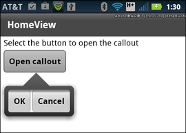

# Add a callout container to a mobile application

In a mobile application, a callout is a container that pops up on top of the
application. The container can hold one or more components, and supports
different types of layouts.

A callout container can be modal or nonmodal. A modal container takes all
keyboard and mouse input until it is closed. A nonmodal container allows other
components in the application to accept input while the container is open.

Flex provides two components that you can use to add callout containers to a
mobile application:
[CalloutButton](https://help.adobe.com/en_US/FlashPlatform/reference/actionscript/3/spark/components/CalloutButton.html)
and
[Callout](https://help.adobe.com/en_US/FlashPlatform/reference/actionscript/3/spark/components/Callout.html).

<table>
<colgroup>
<col style="width: 25%" />
<col style="width: 25%" />
<col style="width: 25%" />
<col style="width: 25%" />
</colgroup>
<tbody>
<tr class="odd">
<td colspan="2"><h2 id="adobe-recommends">Adobe recommends</h2></td>
<td colspan="2"><h3 id="have-a-tutorial-you-would-like-to-share"><a
href="https://web.archive.org/web/20150212015829mp_/http://www.adobe.com/community/publishing/download.html">Have
a tutorial you would like to share?</a></h3></td>
</tr>
<tr class="even">
<td colspan="4" height="10"></td>
</tr>
<tr class="odd">
<td width="5%"></td>
<td width="45%"><h3 id="callout-component-sample"><a
href="https://web.archive.org/web/20150212015829mp_/http://devgirl.org/2011/10/17/flex-mobile-development-callout-component-sample-with-source/">Callout
Component Sample</a></h3>
Holly Schinsky 
Describes how to use the Callout container to define a pop-up
container for your mobile application.</td>
<td width="5%"></td>
<td width="45%"></td>
</tr>
</tbody>
</table>

## Use the CalloutButton control to create a callout container

The
[CalloutButton](https://help.adobe.com/en_US/FlashPlatform/reference/actionscript/3/spark/components/CalloutButton.html)
control provides a simple way to create a callout container. The component lets
you define the components that appear in the callout and to set the container
layout.

When you select the CalloutButton control in a mobile application, the control
opens the callout container. Flex automatically draws an arrow from the callout
container back to the CalloutButton control, as the following figure shows:

The following example shows the mobile application that creates the
CalloutButton shown in the previous figure:

    <?xml version="1.0" encoding="utf-8"?>
    <!-- components\mobile\views\CalloutButtonSimpleHomeView.mxml -->
    <s:View xmlns:fx="http://ns.adobe.com/mxml/2009"
    	xmlns:s="library://ns.adobe.com/flex/spark"
    	title="HomeView">
    	<s:layout>
    		<s:VerticalLayout
    			paddingLeft="10" paddingTop="10"/>
    	</s:layout>

    	<s:Label text="Select the button to open the callout"/>

    	<s:CalloutButton id="myCB"
    		horizontalPosition="end"
    		verticalPosition="after"
    		label="Open callout">
    		<s:calloutLayout>
    			<s:HorizontalLayout/>
    		</s:calloutLayout>

    		<!-- Define buttons that appear in the callout. -->
    		<s:Button label="OK"
    			click="myCB.closeDropDown();"/>
    		<s:Button label="Cancel"
    			click="myCB.closeDropDown();"/>
    	</s:CalloutButton>
    </s:View>

The CalloutButton control defines two Button controls that appear inside the
callout container. The CalloutButton control also specifies to use
HorizontalLayout as the layout of the callout container. By default, the
container uses BasicLayout.

**Open and close a callout container with the CalloutButton control**

The callout container opens when the user selects the CalloutButton control, or
when you call the `CalloutButton.openDropDown()` method. The
`horizontalPosition` and `verticalPosition` properties determine the position of
the callout container relative to the CalloutButton control. For an example, see
[Size and position a callout container](#size-and-position-a-callout-container).

The callout container opened by the CalloutButton is always nonmodal. That means
other components in the application can receive input while the callout is open.
Use the Callout container to create a modal callout.

The callout container stays open until you click outside the callout container,
or you call the `CalloutButton.closeDropDown()` method. In this example, you
call the `closeDropDown()` method in the event handler for the `click` event for
the two Button controls in the callout container.

## Use the Callout container to create a callout

The
[CalloutButton](https://help.adobe.com/en_US/FlashPlatform/reference/actionscript/3/spark/components/CalloutButton.html)
control encapsulates in a single control the callout container and all of the
logic necessary to open and close the callout. The CalloutButton control is then
said to be the _host_ of the callout container.

You can also use the
[Callout](https://help.adobe.com/en_US/FlashPlatform/reference/actionscript/3/spark/components/Callout.html)
container in a mobile application. The advantage of a Callout container is that
it is not associated with a single host, and is therefore reusable anywhere in
the application.

Use the `Callout.open()` and `Callout.close()` methods to open a Callout
container, typically in response to an event. When you call the `open()` method,
you can pass an optional argument to specify that the callout container is
modal. By default, the callout container is nonmodal.

The position of the callout container is relative to the host component. The
`horizontalPosition` and `verticalPosition` properties determine the container's
location relative to the host. For an example, see
[Size and position a callout container](#size-and-position-a-callout-container).

Because it is a pop-up, you do not create a Callout container as part of the
normal MXML layout code of your application. Instead, you define the Callout
container as a custom MXML component in an MXML file.

In the following example, define a Callout container in the file MyCallout.mxml
in the comps directory of your application:

    <?xml version="1.0" encoding="utf-8"?>
    <!-- components\mobile\comps\MyCallout.mxml -->
    <s:Callout xmlns:fx="http://ns.adobe.com/mxml/2009"
    	xmlns:s="library://ns.adobe.com/flex/spark"
    	horizontalPosition="start"
    	verticalPosition="after">

    	<s:VGroup
    		paddingTop="10" paddingLeft="5" paddingRight="10">

    		<s:HGroup verticalAlign="middle">
    			<s:Label text="First Name: "
    				fontWeight="bold"/>
    			<s:TextInput width="225"/>
    		</s:HGroup>

    		<s:HGroup verticalAlign="middle">
    			<s:Label text="Last Name: "
    				fontWeight="bold"/>
    			<s:TextInput width="225"/>
    		</s:HGroup>

    		<s:HGroup>
    			<s:Button label="OK" click="close();"/>
    			<s:Button label="Cancel" click="close();"/>
    		</s:HGroup>
    	</s:VGroup>
    </s:Callout>

MyCallout.mxml defines a simple pop-up to let a user enter a first and last
name. Notice that the buttons call the `close()` method to close the callout in
response to a `click` event.

The following example shows a View container that opens MyCallout.mxml in
response to a `click` event:

    <?xml version="1.0" encoding="utf-8"?>
    <!-- components\mobile\views\CalloutSimpleHomeView.mxml -->
    <s:View xmlns:fx="http://ns.adobe.com/mxml/2009"
    	xmlns:s="library://ns.adobe.com/flex/spark"
    	title="HomeView">
    	<s:layout>
    		<s:VerticalLayout
    			paddingLeft="10" paddingTop="10"/>
    	</s:layout>

    	<fx:Script>
    		<![CDATA[
    			import comps.MyCallout;

    			// Event handler to open the Callout component.
    			protected function button1_clickHandler(event:MouseEvent):void {
    				var myCallout:MyCallout = new MyCallout();
    				// Open as a modal callout.
    				myCallout.open(calloutB, true);
    			}
    		]]>
    	</fx:Script>

    	<s:Label text="Select the button to open the callout"/>
    	<s:Button id="calloutB"
    		label="Open Callout container"
    		click="button1_clickHandler(event);"/>
    </s:View>

First, import the MyCallout.mxml component into the application. In response to
a `click` event, the button named calloutB creates an instance of
MyCallout.mxml, and then calls the `open()` method.

The `open()` method species two arguments. The first argument specifies that
calloutB is the host component of the callout. Therefore, the callout positions
itself in the application relative to the location of calloutB. The second
argument is `true` to create a modal callout.

### Define an inline Callout container

You do not have to define the
[Callout](https://help.adobe.com/en_US/FlashPlatform/reference/actionscript/3/spark/components/Callout.html)
container in a separate file. The following example uses the `<fx:Declaration>`
tag to define it as an inline component of a
[View](https://help.adobe.com/en_US/FlashPlatform/reference/actionscript/3/spark/components/View.html)
container:

    <?xml version="1.0" encoding="utf-8"?>
    <!-- components\mobile\views\CalloutInlineHomeView.mxml -->
    <s:View xmlns:fx="http://ns.adobe.com/mxml/2009"
    	xmlns:s="library://ns.adobe.com/flex/spark"
    	title="HomeView">
    	<s:layout>
    		<s:VerticalLayout
    			paddingLeft="10" paddingTop="10"/>
    	</s:layout>

    	<fx:Script>
    		<![CDATA[
    			// Event handler to open the Callout component.
    			protected function button1_clickHandler(event:MouseEvent):void {
    				var myCallout:MyCallout = new MyCallout();
    				// Open as a modal callout.
    				myCallout.open(calloutB, true);
    			}
    		]]>
    	</fx:Script>

    	<fx:Declarations>
    		<fx:Component className="MyCallout">
    			<s:Callout
    				horizontalPosition="end"
    				verticalPosition="after">
    				<s:VGroup
    					paddingTop="10" paddingLeft="5" paddingRight="10">
    					<s:HGroup verticalAlign="middle">
    						<s:Label text="First Name: "
    								 fontWeight="bold"/>
    						<s:TextInput width="225"/>
    					</s:HGroup>
    					<s:HGroup verticalAlign="middle">
    						<s:Label text="Last Name: "
    								 fontWeight="bold"/>
    						<s:TextInput width="225"/>
    					</s:HGroup>
    					<s:HGroup>
    						<s:Button label="OK" click="close();"/>
    						<s:Button label="Cancel" click="close();"/>
    					</s:HGroup>
    				</s:VGroup>
    			</s:Callout>
    		</fx:Component>
    	</fx:Declarations>

    	<s:Label text="Select the button to open the callout"/>
    	<s:Button id="calloutB"
    		label="Open Callout container"
    		click="button1_clickHandler(event);"/>
    </s:View>

### Pass data back from the Callout container

Use the `close()` method of the
[Callout](https://help.adobe.com/en_US/FlashPlatform/reference/actionscript/3/spark/components/Callout.html)
container to pass data back to the main application. The `close()` method has
the following signature:

    public function close(commit:Boolean = false, data:*):void

where:

- `commit` contains `true` if the application should commit the returned data.

- `data` specifies the returned data.

Calling the `close()` method dispatches a `close` event. The event object
associated with the `close` event is an object of type
[spark.events.PopUpEvent](https://help.adobe.com/en_US/FlashPlatform/reference/actionscript/3/spark/events/PopUpEvent.html).
The PopUpEvent class defines two properties, `commit` and `data`, that contain
the values of the corresponding arguments to the `close()` method. Use these
properties in the event handler of the `close` event to inspect any data
returned from the callout.

The callout container is a subclass of the SkinnablePopUpContainer class, which
uses the same mechanism to pass data back to the main application. For an
example of passing data back from the SkinnablePopUpContainer container, see
[Passing data back from the Spark SkinnablePopUpContainer container](https://web.archive.org/web/20150212015829mp_/http://help.adobe.com/en_US/flex/using/WSf50d443f3931dfaa684f795512d5c798aa6-8000.html).

The following example modifies the Callout component shown above to return the
first and last name values:

    <?xml version="1.0" encoding="utf-8"?>
    <!-- components\mobile\comps\MyCalloutPassBack.mxml -->
    <s:Callout xmlns:fx="http://ns.adobe.com/mxml/2009"
    	xmlns:s="library://ns.adobe.com/flex/spark"
    	horizontalPosition="start"
    	verticalPosition="after">

    	<fx:Script>
    		<![CDATA[
    			import spark.events.IndexChangeEvent;

    			public var retData:String = new String();

    			// Event handler for the click event of the OK button.
    			protected function clickHandler(event:MouseEvent):void {
    				//Create the return data.
    				retData = firstName.text + " " + lastName.text;

    				// Close the Callout.
    				// Set the commit argument to true to indicate that the
    				// data argument contains a valid value.
    				close(true, retData);
    			}

    		]]>
    	</fx:Script>

    	<s:VGroup
    		paddingTop="10" paddingLeft="5" paddingRight="10">
    		<s:HGroup verticalAlign="middle">
    			<s:Label text="First Name: "
    					 fontWeight="bold"/>
    			<s:TextInput id="firstName" width="225"/>
    		</s:HGroup>
    		<s:HGroup verticalAlign="middle">
    			<s:Label text="Last Name: "
    					 fontWeight="bold"/>
    			<s:TextInput id="lastName" width="225"/>
    		</s:HGroup>
    		<s:HGroup>
    			<s:Button label="OK" click="clickHandler(event);"/>
    			<s:Button label="Cancel" click="close();"/>
    		</s:HGroup>
    	</s:VGroup>
    </s:Callout>

In this example, you create a String to return the first and last names in
response to the user selecting the OK button.

The View container then uses the `close` event on the Callout to display the
returned data:

    <?xml version="1.0" encoding="utf-8"?>
    <!-- components\mobile\views\CalloutPassBackDataHomeView.mxml -->
    <s:View xmlns:fx="http://ns.adobe.com/mxml/2009"
    		xmlns:s="library://ns.adobe.com/flex/spark"
    		title="HomeView">
    	<s:layout>
    		<s:VerticalLayout
    			paddingLeft="10" paddingTop="10"/>
    	</s:layout>

    	<fx:Script>
    		<![CDATA[
    			import comps.MyCalloutPassBack;
    			import spark.events.PopUpEvent;

    			public var myCallout:MyCalloutPassBack = new MyCalloutPassBack();

    			// Event handler to open the Callout component.
    			protected function clickHandler(event:MouseEvent):void {
    				// Add an event handler for the close event to check for
    				// any returned data.
    				myCallout.addEventListener('close', closeHandler);
    				// Open as a modal callout.
    				myCallout.open(calloutB, true);
    			}

    			// Handle the close event from the Callout.
    			protected function closeHandler(event:PopUpEvent):void {
    				// If commit is false, no data is returned.
    				if (!event.commit)
    					return;

    				// Write the returned Data to the TextArea control.
    				myTA.text = String(event.data);

    				// Remove the event handler.
    				myCallout.removeEventListener('close', closeHandler);
    			}

    		]]>
    	</fx:Script>

    	<s:Label text="Select the button to open the callout"/>
    	<s:Button id="calloutB"
    		label="Open Callout container"
    		click="clickHandler(event);"/>
    	<s:TextArea id="myTA"/>
    </s:View>

### Add a ViewNavigator to a Callout

You can use a
[ViewNavigator](https://help.adobe.com/en_US/FlashPlatform/reference/actionscript/3/spark/components/ViewNavigator.html)
in a Callout container. The ViewNavigator lets you add an action bar and
multiple views to the callout.

For example, the following View opens a Callout container defined in the file
MyCalloutPassBackVN:

    <?xml version="1.0" encoding="utf-8"?>
    <!-- components\mobile\views\CalloutPassBackDataHomeView.mxml -->
    <s:View xmlns:fx="http://ns.adobe.com/mxml/2009"
    	xmlns:s="library://ns.adobe.com/flex/spark"
    	title="HomeView">
    	<s:layout>
    		<s:VerticalLayout
    			paddingLeft="10" paddingTop="10"/>
    	</s:layout>

    	<fx:Script>
    		<![CDATA[
    			import comps.MyCalloutPassBackVN;
    			import spark.events.PopUpEvent;

    			public var myCallout:MyCalloutPassBackVN = new MyCalloutPassBackVN();

    			// Event handler to open the Callout component.
    			protected function clickHandler(event:MouseEvent):void {
    				myCallout.addEventListener('close', closeHandler);
    				myCallout.open(calloutB, true);
    			}

    			// Handle the close event from the Callout.
    			protected function closeHandler(event:PopUpEvent):void {
    				if (!event.commit)
    					return;

    				myTA.text = String(event.data);
    				myCallout.removeEventListener('close', closeHandler);
    			}
    		]]>
    	</fx:Script>

    	<s:Label text="Select the Open button to open the callout"/>
    	<s:TextArea id="myTA"/>
    	<s:actionContent>
    		<s:Button id="calloutB" label="Open"
    			click="clickHandler(event);"/>
    	</s:actionContent>
    </s:View>

The MyCalloutPassBackVN.mxml file defines the Callout container that holds a
ViewNavigator container:

    <?xml version="1.0" encoding="utf-8"?>
    <!-- components\mobile\comps\MyCalloutVN.mxml -->
    <s:Callout xmlns:fx="http://ns.adobe.com/mxml/2009"
    	xmlns:s="library://ns.adobe.com/flex/spark"
    	contentBackgroundAppearance="none"
    	horizontalPosition="start"
    	verticalPosition="after">

    	<fx:Script>
    		<![CDATA[
    			import mx.events.FlexMouseEvent;
    			import views.SettingsView;

    			protected function done_clickHandler(event:MouseEvent):void {
    				// Create an instance of SettingsView, and
    				// initialize it as a copy of the current View of the ViewNavigator.
    				var settings:SettingsView = (viewNav.activeView as SettingsView);

    				// Create the String to represent the returned data.
    				var retData:String = new String();
    				// Initialze the String from the current View.
    				retData = settings.firstName.text + " " + settings.lastName.text;
    				// Close the Callout and return thhe data.
    				this.close(true, retData);
    			}
    		]]>
    	</fx:Script>

    	<s:ViewNavigator id="viewNav" width="100%" height="100%" firstView="views.SettingsView">
    		<s:navigationContent>
    			<s:Button label="Cancel" click="close(false)"/>
    		</s:navigationContent>
    		<s:actionContent>
    			<s:Button id="done" label="OK" emphasized="true" click="done_clickHandler(event);"/>
    		</s:actionContent>
    	</s:ViewNavigator>
    </s:Callout>

In MyCalloutPassBackVN.mxml, you specify that the first view of the
ViewNavigator is SettingsView. SettingsView defines TextInput controls for a
users first and last name. When the user selects the OK button, you close the
Callout and pass back any returned data to MyCalloutPassBackVN.

> **Note:** When a ViewNavigator appears in a Callout container, the ActionBar
> has a transparent background color. In this example, you set the
> `contentBackgroundAppearance` to `none` on the Callout container. This setting
> prevents the default white `contentBackgroundColor` of the Callout from
> appearing in the area of the transparent ActionBar.

The following figure shows the application with the Callout open:

Shown below is SettingsView.mxml:

    <?xml version="1.0" encoding="utf-8"?>
    <!-- components\mobile\views\SettingsView.mxml -->
    <s:View xmlns:fx="http://ns.adobe.com/mxml/2009"
    		xmlns:s="library://ns.adobe.com/flex/spark"
    		title="Settings">

    	<s:VGroup
    		paddingTop="10" paddingLeft="5" paddingRight="10">
    		<s:HGroup verticalAlign="middle">
    			<s:Label text="First Name: "
    				fontWeight="bold"/>
    			<s:TextInput id="firstName" width="225"/>
    		</s:HGroup>
    		<s:HGroup verticalAlign="middle">
    			<s:Label text="Last Name: "
    				fontWeight="bold"/>
    			<s:TextInput id="lastName" width="225"/>
    		</s:HGroup>
    	</s:VGroup>
    </s:View>

> **Note:** The ActionBar defined by a ViewNavigator in a Callout container has
> a transparent background. By default, a transition from one View to another
> View appears correctly in the Callout. However, if you specify a nondefault
> transition, such as a CrossFadeViewTransition or a ZoomViewTransition, the
> ActionBar area of the two views can overlap. To work around this issue, create
> a custom skin class for the ActionBar and the Callout that uses a
> nontransparent background.

## Size and position a callout container

The
[CalloutButton](https://help.adobe.com/en_US/FlashPlatform/reference/actionscript/3/spark/components/CalloutButton.html)
control and
[Callout](https://help.adobe.com/en_US/FlashPlatform/reference/actionscript/3/spark/components/Callout.html)
container use two properties to specify the location of the callout container
relative to its host: `horizontalPosition` and `verticalPosition`. These
properties can have the following values: "`before`", "`start`", "`middle`",
"`end`", "`after`", and "`auto`" (default).

For example, you set these properties as shown below:

    horizontalPosition="before"
    verticalPosition="after"

The callout container opens to the left, and below the host component. If you
set them as below:

    horizontalPosition="middle"
    verticalPosition="middle"

The callout container opens on top of the host component with the center of the
callout aligned to the center of the host component.

**Draw an arrow from the callout to the host**

For all but five combinations of the `horizontalPosition` and `verticalPosition`
properties, the callout draws an arrow pointing to the host. The positions where
no arrow appears are when the callout is centered over the middle of the host,
and when it is in a corner. The following combinations show no arrow:

    // Centered
    horizontalPosition="middle"
    verticalPosition="middle"

    // Upper-left corner
    horizontalPosition="before"
    verticalPosition="before"

    // Lower-left corner
    horizontalPosition="before"
    verticalPosition="after"

    // Upper-right corner
    horizontalPosition="after"
    verticalPosition="before"

    // Lower-right corner
    horizontalPosition="after"
    verticalPosition="after"

For the Callout container, the `horizontalPosition` and `verticalPosition`
properties also determine the value of the read-only `Callout.arrowDirection`
property. The position of the callout container relative to the host determines
the value of the `arrowDirection` property. Possible values are `"up"`,
`"left"`, and others.

The `Callout.arrow` skin part uses the value of the `arrowDirection` property to
draw the arrow based on the position of the callout.

## Manage memory for a callout container

One consideration when using a callout container is how to manage the memory
used by the callout. For example, if you want to reduce the memory used of the
application, create an instance of the callout each time it opens. The callout
is then destroyed when it closes. However, make sure to remove all references to
the callout, especially event handlers, or else the callout is not destroyed.

Alternatively, if the callout container is relatively small, you can reuse the
same callout multiple times in the application. In this configuration, the
application creates a single instance of the callout. It then reuses that
instance and the callout stays in memory between uses. This configuration
reduces execution time in the application because the application does not have
to re-create the callout every time it is opened.

**Manage memory with the CalloutButton control**

To configure the callout used by the
[CalloutButton](https://help.adobe.com/en_US/FlashPlatform/reference/actionscript/3/spark/components/CalloutButton.html)
control, set the `CalloutButton.calloutDestructionPolicy` property. A value of
`"auto"` configures the control to destroy the callout when it is closed. A
value of `"never"` configures the control to cache the callout in memory.

**Manage memory with the Callout container**

The
[Callout](https://help.adobe.com/en_US/FlashPlatform/reference/actionscript/3/spark/components/Callout.html)
container does not define the `calloutDestructionPolicy` property. Instead,
control its memory use by how you create an instance of the callout container in
your application. In the following example, you create an instance of the
callout container every time you open it:

    protected function button1_clickHandler(event:MouseEvent):void {
    	// Create a new instance of the callout container every time you open it.
    	var myCallout:MyCallout = new MyCallout();
    	myCallout.open(calloutB, true);
    }

Alternatively, you can define a single instance of the callout container that
you reuse every time you open it:

    // Create a single instance of the callout container.
    public var myCallout:MyCallout = new MyCallout();

    protected function button1_clickHandler(event:MouseEvent):void {
    	myCallout.open(calloutB, true);
    }
