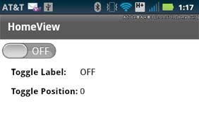

# Add a toggle switch to a mobile application

The Spark
[ToggleSwitch](https://help.adobe.com/en_US/FlashPlatform/reference/actionscript/3/spark/components/ToggleSwitch.html)
control defines a simple binary switch. The control consists of thumb and a
track along which you slide the thumb.

The ToggleSwitch control is similar to the ToggleButton and CheckBox controls.
All of these controls let you choose between a selected and an unselected value.

The following image shows the ToggleSwitch control in an application:

The ToggleSwitch control has two positions: selected and unselected. The control
is in the unselected position when the thumb is to the left. The selected
position is when the thumb is to the right. In the figure, the switch is in the
unselected position.

Clicking anywhere in the control toggles its position. You can also slide the
thumb along the track to change position. When you release the thumb, it moves
to the position, selected or unselected, that is closest to the thumb location.

By default, the label OFF corresponds to the unselected position and ON
corresponds to the selected position.

## Create a ToggleSwitch control

Shown below is the
[View](https://help.adobe.com/en_US/FlashPlatform/reference/actionscript/3/spark/components/View.html)
container that defines the ToggleSwitch control shown in the previous figure:

    <?xml version="1.0" encoding="utf-8"?>
    <!-- components\mobile\views\ToggleSwitchSimpleHomeView.mxml -->
    <s:View xmlns:fx="http://ns.adobe.com/mxml/2009"
        xmlns:s="library://ns.adobe.com/flex/spark"
        title="HomeView">
        <s:layout>
            <s:VerticalLayout
                paddingTop="10" paddingLeft="5"/>
        </s:layout>

        <s:ToggleSwitch id="ts"
            slideDuration="1000"/>

        <s:Form>
            <s:FormItem label="Toggle Label: ">
                <s:Label text="{ts.selected ? 'ON' : 'OFF'}"/>
            </s:FormItem>
            <s:FormItem label="Toggle Position: ">
                <s:Label text="{ts.thumbPosition}"/>
            </s:FormItem>
        </s:Form>
    </s:View>

In this example, you display ON or OFF in the first Label control based on the
thumb position. The second label control displays the current thumb position as
a value between 0.0 (unselected0 and 1.0 (selected).

This example also sets the `slideDuration` style to 1000. This style determines
the duration, in milliseconds, for an animation of the thumb as it slides
between the selected and unselected positions.

Shown below is the main application file:

    <?xml version="1.0" encoding="utf-8"?>
    <!-- components\mobile\ToggleSwitchSimple.mxml -->
    <s:ViewNavigatorApplication xmlns:fx="http://ns.adobe.com/mxml/2009"
        xmlns:s="library://ns.adobe.com/flex/spark"
        firstView="views.ToggleSwitchSimpleHomeView">

    </s:ViewNavigatorApplication>

## Change the default callout of a ToggleSwitch control

In the previous example, the ToggleSwitch control uses the default values for
the unselected and selected labels: OFF (unselected) and ON (selected). To
customize the labels or other visual characteristics of the control, define a
skin class as a subclass of
[spark.skins.mobile.ToggleSwitchSkin](https://help.adobe.com/en_US/FlashPlatform/reference/actionscript/3/spark/skins/mobile/ToggleSwitchSkin.html)
or create your own skin class.

The following skin class changes the labels to Yes and No:

    // components\mobile\skins\MyToggleSwitchSkin.as
    package skins
    {
        import spark.skins.mobile.ToggleSwitchSkin;

        public class MyToggleSwitchSkin extends ToggleSwitchSkin
        {
            public function MyToggleSwitchSkin()
            {
                super();
                // Set properties to define the labels
                // for the selected and unselected positions.
                selectedLabel="Yes";
                unselectedLabel="No";
            }
        }
    }

The following View container uses this skin class:

    <?xml version="1.0" encoding="utf-8"?>
    <!-- components\mobile\views\ToggleSwitchSkinHomeView.mxml -->
    <s:View xmlns:fx="http://ns.adobe.com/mxml/2009"
        xmlns:s="library://ns.adobe.com/flex/spark"
        title="HomeView">
        <s:layout>
            <s:VerticalLayout
                paddingTop="10" paddingLeft="5"/>
        </s:layout>

        <s:ToggleSwitch id="ts"
            slideDuration="1000"
            skinClass="skins.MyToggleSwitchSkin"/>

        <s:Form>
            <s:FormItem label="Toggle Label: ">
                <s:Label text="{ts.selected ? 'Yes' : 'No'}"/>
            </s:FormItem>
            <s:FormItem label="Toggle Position: ">
                <s:Label text="{ts.thumbPosition}"/>
            </s:FormItem>
        </s:Form>
    </s:View>
