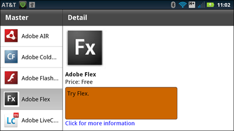
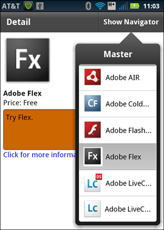

# Create multiple panes in a mobile application

[SplitViewNavigator](https://help.adobe.com/en_US/FlashPlatform/reference/actionscript/3/spark/components/SplitViewNavigator.html)
is a skinnable container that displays two or more child view navigators in the
same screen of a mobile device. Each view navigator appears in a separate pane
managed by the SplitViewNavigator container.

The children of the SplitViewNavigator container can be any component that
extends
[ViewNavigatorBase](https://help.adobe.com/en_US/FlashPlatform/reference/actionscript/3/spark/components/supportClasses/ViewNavigatorBase.html).
Therefore, you can use the
[ViewNavigator](https://help.adobe.com/en_US/FlashPlatform/reference/actionscript/3/spark/components/ViewNavigator.html)
and
[TabbedViewNavigator](https://help.adobe.com/en_US/FlashPlatform/reference/actionscript/3/spark/components/TabbedViewNavigator.html)
containers as its children.

> **Note:** Because of the screen space required to display multiple panes
> simultaneously, Adobe recommends that you only use the SplitViewNavigator on a
> tablet.

By default, SplitViewNavigator lays out the panes, corresponding to its
children, horizontally. You can specify to use a vertical layout, or define a
custom layout instead.

## Create a SplitViewNavigator container

A common interface pattern for tablet devices is the master/detail pattern. This
pattern divides the screen into two main content areas: the master pane and the
detail pane. Typically, the user interacts with the master pane to control the
display of content in the detail pane.

Each pane corresponds to a child of the SplitViewNavigator, where the children
are either ViewNavigator or TabbedViewNavigator containers. Because its children
are view navigators, the view navigator for each pane contains its own view
stack and action bar.

The following image shows the
[SplitViewNavigator](https://help.adobe.com/en_US/FlashPlatform/reference/actionscript/3/spark/components/SplitViewNavigator.html)
container in an application with a master and a detail pane:

In this example, the master pane on the left contains a Spark List control that
displays a set of Adobe products. The detail pane on the right displays
additional information about the currently selected product in the master pane.

Shown below is the main application file for this example:

    <?xml version="1.0" encoding="utf-8"?>
    <!-- containers\mobile\SparkSplitVNSimple.mxml -->
    <s:Application xmlns:fx="http://ns.adobe.com/mxml/2009"
    	xmlns:s="library://ns.adobe.com/flex/spark">

    	<s:SplitViewNavigator width="100%" height="100%">
    		<s:ViewNavigator width="256" height="100%"
    			firstView="views.MasterCategory"/>
    		<s:ViewNavigator width="100%" height="100%"
    			firstView="views.DetailView"/>
    	</s:SplitViewNavigator>
    </s:Application>

A SplitViewNavigator can be the child of the
[Application](https://help.adobe.com/en_US/FlashPlatform/reference/actionscript/3/spark/components/Application.html)
or
[TabbedViewNavigatorApplication](https://help.adobe.com/en_US/FlashPlatform/reference/actionscript/3/spark/components/TabbedViewNavigatorApplication.html)
containers. In this example, the SplitViewNavigator is the only child of the
Application container. Notice that the SplitViewNavigator specifies a height and
width of 100% to occupy the full area of the device's screen.

In this example, the children of the SplitViewNavigator are ViewNavigator
containers. The first ViewNavigator define the master pane, and the second
defines the detail pane.

> **Note:** A SplitViewNavigator can have more than two children. Therefore, you
> could create a SplitViewNavigator with three, four, or more panes.

### Access the panes and views of a SplitViewNavigator container

The
[SplitViewNavigator](https://help.adobe.com/en_US/FlashPlatform/reference/actionscript/3/spark/components/SplitViewNavigator.html)
container defines methods and properties that you use to access its children.
For example, use the `SplitViewNavigator.numViewNavigators` property to
determine the number of child view navigators of the SplitViewNavigator.

Use the `SplitViewNavigator.getViewNavigatorAt()` method to access the children
of the SplitViewNavigator based on the child's index. In the example above, the
ViewNavigator of the master pane is at index 0, and the ViewNavigator of the
detail pane is at index 1.

> **Note:** The SplitViewNavigator container inherits the getElementAt() and
> getElementIndex() methods. Do not use those methods with SplitViewNavigator.
> Instead, use getViewNavigatorAt().

From a reference to the ViewNavigator for an individual pane, the
SplitViewNavigator can access the individual views of the pane.

Access the SplitViewNavigator container from a child by using the
`parentNavigator` property of the child. For example,
`ViewNavigator.parentNavigator` contains a reference to the parent
SplitViewNavigator container.

A View container accesses its parent view navigator by using the
`View.navigator` property. Therefore, a view can access the SplitViewNavigator
by using `View.navigator.parentNavigator`.

In the example above, the ViewNavigator for the master pane specifies as its
first view MasterCategory. That view is defined in the MasterCategory.mxml file,
as shown below:

    <?xml version="1.0" encoding="utf-8"?>
    <!-- containers\mobile\views\MasterCategory.mxml -->
    <s:View xmlns:fx="http://ns.adobe.com/mxml/2009"
    		xmlns:s="library://ns.adobe.com/flex/spark"
    		title="Master">

    	<fx:Script>
    		<![CDATA[
    			import spark.components.SplitViewNavigator;
    			import spark.components.ViewNavigator;
    			import spark.events.IndexChangeEvent;

    			protected function myList_changeHandler(event:IndexChangeEvent):void {
    				// Create a reference to the SplitViewNavigator.
    				var splitNavigator:SplitViewNavigator = navigator.parentNavigator as SplitViewNavigator;

    				// Create a reference to the ViewNavigator for the Detail frame.
    				var detailNavigator:ViewNavigator = splitNavigator.getViewNavigatorAt(1) as ViewNavigator;

    				// Change the view of the Detail frame based on the selected List item.
    				detailNavigator.pushView(DetailView, myList.selectedItem);
    			}
    		]]>
    	</fx:Script>

    	<s:List width="100%" height="100%" id="myList"
    			change="myList_changeHandler(event);">
    		<s:dataProvider>
    			<s:ArrayCollection>
    				<fx:Object Product="Adobe AIR" Price="11.99"
    						   Image="@Embed(source='../assets/air_icon_sm.jpg')"
    						   Description="Try AIR." Link="air"/>
    				<fx:Object Product="Adobe ColdFusion" Price="11.99"
    						   Image="@Embed(source='../assets/coldfusion_icon_sm.jpg')"
    						   Description="Try ColdFusion." Link="coldfusion"/>
    				<fx:Object Product="Adobe Flash Player" Price="11.99"
    						   Image="@Embed(source='../assets/flashplayer_icon_sm.jpg')"
    						   Description="Try Flash." Link="flashplayer"/>
    				<fx:Object Product="Adobe Flex" Price="Free"
    						   Image="@Embed(source='../assets/flex_icon_sm.jpg')"
    						   Description="Try Flex." Link="flex.html"/>
    				<fx:Object Product="Adobe LiveCycleDS" Price="11.99"
    						   Image="@Embed(source='../assets/livecycleds_icon_sm.jpg')"
    						   Description="Try LiveCycle DS." Link="livcycle"/>
    				<fx:Object Product="Adobe LiveCycle ES2" Price="11.99"
    						   Image="@Embed(source='../assets/livecyclees_icon_sm.jpg')"
    						   Description="Try LiveCycle ES." Link="livcycle"/>
    			</s:ArrayCollection>
    		</s:dataProvider>
    		<s:itemRenderer>
    			<fx:Component>
    				<s:IconItemRenderer
    					labelField="Product"
    					iconField="Image"/>
    			</fx:Component>
    		</s:itemRenderer>
    	</s:List>
    </s:View>

MasterCategory.mxml defines a single
[List](https://help.adobe.com/en_US/FlashPlatform/reference/actionscript/3/spark/components/List.html)
control that contains information about Adobe products. The List control uses a
custom item renderer to display a label and an icon for each product. For more
information about defining item renderers, see
[Using a mobile item renderer with a Spark list-based control](https://web.archive.org/web/20150425051753mp_/http://help.adobe.com/en_US/flex/using/WS77c1dbb1bd80d3836663fb6012af31eb8a5-8000.html).

The List control in the master pane uses the `change` event to update the detail
pane in response to a user action. The event handler first obtains a reference
to the SplitViewNavigator container. From that reference, it obtains a reference
to the ViewNavigator of the detail frame.

Finally, the event handler calls the `push()`method on the ViewNavigator of the
detail frame. The `push()` method takes two arguments, the view pushed onto the
stack of the ViewNavigator, and an object containing information about the
selected List item.

### Update the detail pane of a SplitViewNavigator container

The detail pane of the example above displays information about the selected
item in the List control of the master pane. The detail pane is named
DetailView, and is defined in the DetailView.mxml file, as shown below:

    <?xml version="1.0" encoding="utf-8"?>
    <!-- containers\mobile\views\DetailView.mxml -->
    <s:View xmlns:fx="http://ns.adobe.com/mxml/2009"
    	xmlns:s="library://ns.adobe.com/flex/spark"
    	title="Detail">

    	<s:layout>
    		<s:VerticalLayout paddingTop="10" paddingLeft="10" paddingRight="10"/>
    	</s:layout>

    	<fx:Script>
    		<![CDATA[

    			// Use navigateToURL() to open a link to the product page.
    			protected function label1_clickHandler(event:MouseEvent):void {
    				var destinationURL:String = "http://www.adobe.com/products/" + data.Link;
    				navigateToURL(new URLRequest(destinationURL));
    			}
    		]]>
    	</fx:Script>

    	<s:VGroup width="461" height="670">
    		<s:Image source="{data.Image}"
    			height="176" width="169"
    			horizontalCenter="0" top="0"/>
    		<s:Label text="{data.Product}"
    			fontSize="24" fontWeight="bold"
    			top="100" left="0"/>
    		<s:Label text="Price: {data.Price}"
    			top="125" left="0"/>
    		<s:TextArea y="174"
    			width="100%" height="20%"
    			contentBackgroundColor="0xCC6600"
    			text="{data.Description}"/>
    		<s:Label text="Click for more information"
    			color="#0000FF"
    			click="label1_clickHandler(event)"/>
    	</s:VGroup>
    </s:View>

The master pane passes an object to the DetailView.mxml file corresponding to
the selected item in the List control. The detail pane accesses that data by
using the `View.data` property. The detail pane then displays the product's
image, information about the product, and creates a hyperlink to a page with
more information about the product.

For more information about passing data to a View container, see
[Pass data to a view](./define-views-in-a-mobile-application.md#pass-data-to-a-view).

## Display panes based on device orientation

When developing an application for a tablet, you can use a different layout
based on the orientation of the tablet. For example, in landscape mode, the
tablet has a wide screen area that can easily display multiple panes. In
portrait layout, where the screen is narrow, you can choose to hide a pane
because of the reduced width of the screen.

The
[SplitViewNavigator](https://help.adobe.com/en_US/FlashPlatform/reference/actionscript/3/spark/components/SplitViewNavigator.html)
container defines the `autoHideFirstViewNavigator` property that you use to
control the visibility of the first pane for different orientations. By default,
`autoHideFirstViewNavigator` is `false` so that the container shows the first
pane regardless of orientation.

When you set `autoHideFirstViewNavigator` to `true`, the container displays the
first pane in landscape mode, and hides the first pane in portrait mode. The
SplitViewNavigator container hides the first pane by setting the `visible`
property of the associated view navigator to `false`.

In portrait mode with the first pane hidden, use the
`SplitViewNavigator.showFirstViewNavigatorInPopUp()` method to open it. When
called, this method opens the first pane in a Callout container. A callout
container is a pop-up container that appears on top of your application, as the
following figure shows:

This example adds a button labeled Show Navigator to the action bar of the
detail pane of the SplitViewNavigator. When the first pane of the container is
hidden, the user selects this button to open the master pane.

> **Note:** Create a custom skin for the SplitViewNavigator to open the first
> pane in a SkinnablePopUpContainer, or in a subclass of
> SkinnablePopUpContainer.

The `showFirstViewNavigatorInPopUp()` method is ignored when the Callout is
already open. When the device is reoriented to landscape mode, the callout
automatically closes and the first pane reappears.

Clicking outside the Callout container closes it. You can also close it by
calling the `SplitViewNavigator.hideViewNavigatorPopUp()` method.

For more information on the Callout container, see
[Add a callout container to a mobile application](./add-a-callout-container-to-a-mobile-application.md).

### Add an action bar to a pane displayed in a Callout container

Shown below is the main application file that sets the
`autoHideFirstViewNavigator` property of the SplitViewNavigator to `true`. This
example uses view states to add a button to the action bar of the detail pane
when the device is in portrait mode:

    <?xml version="1.0" encoding="utf-8"?>
    <!-- containers\mobile\SparkSVNOrient.mxml -->
    <s:Application xmlns:fx="http://ns.adobe.com/mxml/2009"
    	xmlns:s="library://ns.adobe.com/flex/spark"
    	resize="resizeHandler(event);">

    	<fx:Script>
    		<![CDATA[
    			import mx.events.ResizeEvent;

    			// Update the state based on the orientation of the device.
    			protected function resizeHandler(event:ResizeEvent):void {
    				currentState = aspectRatio;
    			}
    		]]>
    	</fx:Script>

    	<s:states>
    		<s:State name="portrait"/>
    		<s:State name="landscape"/>
    	</s:states>

    	<s:SplitViewNavigator id="splitNavigator"
    			width="100%" height="100%"
    			autoHideFirstViewNavigator="true">

    		<s:ViewNavigator width="256" height="100%"
    			firstView="views.MasterCategoryOrient"/>
    		<s:ViewNavigator width="100%" height="100%"
    			firstView="views.DetailView">
    			<s:actionContent.portrait>
    				<s:Button id="navigatorButton"
    					label="Show Navigator"
    					click="splitNavigator.showFirstViewNavigatorInPopUp(navigatorButton);"/>
    			</s:actionContent.portrait>
    		</s:ViewNavigator>
    	</s:SplitViewNavigator>
    </s:Application>

The application adds an event handler for the `resize` event on the Application
container. Flex dispatches the `resize` event when the orientation of the tablet
changes. In the event handler for the resize event, you set the view state of
the application based on the current orientation. For more information on view
states, see
[View states](https://web.archive.org/web/20150425051753mp_/http://help.adobe.com/en_US/flex/using/WS2db454920e96a9e51e63e3d11c0bf69084-7fb4.html).

The view navigator for the detail pane uses the current state to control the
appearance of a
[Button](https://help.adobe.com/en_US/FlashPlatform/reference/actionscript/3/spark/components/Button.html)
control in the action bar. In landscape mode, the button is hidden because the
master pan is visible.

In portrait mode, when the master pane is hidden, the Button control is visible
in the action bar of the detail pane. The user then selects the Button control
to open the Callout containing the master pane.

Pass a reference to the Button control as the argument to the
`showFirstViewNavigatorInPopUp()` method. This argument specifies the host of
the Callout container, meaning that the Callout is positioned relative to the
Button control.

### Close the SplitViewNavigator callout in response to a user action

Clicking outside the
[Callout](https://help.adobe.com/en_US/FlashPlatform/reference/actionscript/3/spark/components/Callout.html)
container closes it. By default however, clicking within the Callout container
does not close it.

This example closes the Callout when the user selects a List item by calling the
`SplitViewnavigator.hideViewNavigatorPopUp()` method. You call this method in
the event handler of the `change` event of the List control, as the following
example shows:

    <?xml version="1.0" encoding="utf-8"?>
    <!-- containers\mobile\views\MasterCategoryOrient.mxml -->
    <s:View xmlns:fx="http://ns.adobe.com/mxml/2009"
    		xmlns:s="library://ns.adobe.com/flex/spark"
    		title="Master">

    	<fx:Script>
    		<![CDATA[
    			import mx.events.FlexEvent;
    			import spark.components.SplitViewNavigator;
    			import spark.components.ViewNavigator;
    			import spark.events.IndexChangeEvent;

    			protected function myList_changeHandler(event:IndexChangeEvent):void {
    				// Create a reference to the SplitViewNavigator.
    				var splitNavigator:SplitViewNavigator = navigator.parentNavigator as SplitViewNavigator;
    				// Create a reference to the ViewNavigator for the Detail frame.
    				var detailNavigator:ViewNavigator = splitNavigator.getViewNavigatorAt(1) as ViewNavigator;
    				// Change the view of the Detail frame based on the selected List item.
    				detailNavigator.pushView(DetailView, myList.selectedItem);

    				// If the Master is open in a callout, close it.
    				// Otherwise, this method does nothing.
    				splitNavigator.hideViewNavigatorPopUp();
    			}
    		]]>
    	</fx:Script>

    	<s:List width="100%" height="100%" id="myList"
    			change="myList_changeHandler(event);">
    		<s:dataProvider>
    			<s:ArrayCollection>
    				<fx:Object Product="Adobe AIR" Price="11.99"
    						   Image="@Embed(source='../assets/air_icon_sm.jpg')"
    						   Description="Try AIR." Link="air"/>
    				<fx:Object Product="Adobe ColdFusion" Price="11.99"
    						   Image="@Embed(source='../assets/coldfusion_icon_sm.jpg')"
    						   Description="Try ColdFusion." Link="coldfusion"/>
    				<fx:Object Product="Adobe Flash Player" Price="11.99"
    						   Image="@Embed(source='../assets/flashplayer_icon_sm.jpg')"
    						   Description="Try Flash." Link="flashplayer"/>
    				<fx:Object Product="Adobe Flex" Price="Free"
    						   Image="@Embed(source='../assets/flex_icon_sm.jpg')"
    						   Description="Try Flex." Link="flex.html"/>
    				<fx:Object Product="Adobe LiveCycleDS" Price="11.99"
    						   Image="@Embed(source='../assets/livecycleds_icon_sm.jpg')"
    						   Description="Try LiveCycle DS." Link="livcycle"/>
    				<fx:Object Product="Adobe LiveCycle ES2" Price="11.99"
    						   Image="@Embed(source='../assets/livecyclees_icon_sm.jpg')"
    						   Description="Try LiveCycle ES." Link="livcycle"/>
    			</s:ArrayCollection>
    		</s:dataProvider>
    		<s:itemRenderer>
    			<fx:Component>
    				<s:IconItemRenderer
    					labelField="Product"
    					iconField="Image"/>
    			</fx:Component>
    		</s:itemRenderer>
    	</s:List>
    </s:View>

## Implementing persistence for the SplitViewNavigator container

An application for a mobile device is often interrupted by other actions, such
as a text message, a phone call, or other mobile applications. Typically, when
an interrupted application is relaunched, the user expects the previous state of
the application to be restored. The persistence mechanism allows the device to
restore the application to its previous state. For more information, see
[Enable persistence in a mobile application](../application-design-and-workflow/enable-persistence-in-a-mobile-application.md).

SplitViewNavigator implement the `loadViewData()` and `saveViewData()` methods
that it inherits from the ViewNavigatorBase base class. Therefore, the
SplitViewNavigator can serialize and deserialize the navigation stack and view
data for each of its child navigators.

However, you must manually call these methods when your application is
interrupted, as the following example show:

    <?xml version="1.0" encoding="utf-8"?>
    <!-- containers\mobile\SparkSplitVNPersist.mxml -->
    <s:Application xmlns:fx="http://ns.adobe.com/mxml/2009"
    	xmlns:s="library://ns.adobe.com/flex/spark"
    	initialize="initializeHandler(event);">

    	<fx:Script>
    		<![CDATA[
    			import mx.events.FlexEvent;
    			import spark.managers.PersistenceManager;

    			// Create an instance of the PersistenceManager.
    			public var persistenceManager:PersistenceManager;

    			// Event handler to initialize SplitViewNavigator.
    			protected function initializeHandler(event:FlexEvent):void {

    				// Register the event handler for the deactivate event.
    				NativeApplication.nativeApplication.addEventListener(Event.DEACTIVATE, onDeactivate);

    				persistenceManager = new PersistenceManager();
    				persistenceManager.load();

    				var data:Object = persistenceManager.getProperty("navigatorState");
    				if (data)
    					splitNavigator.loadViewData(data);
    			}

    			// Event handler to save SplitViewNavigator on application deactivate event.
    			protected function onDeactivate(event:Event):void {
    				persistenceManager.setProperty("navigatorState", splitNavigator.saveViewData());
    				persistenceManager.save();
    			}
    		]]>
    	</fx:Script>

    	<s:SplitViewNavigator id="splitNavigator" width="100%" height="100%">
    		<s:ViewNavigator width="256" height="100%"
    			firstView="views.MasterCategory"/>
    		<s:ViewNavigator width="100%" height="100%"
    			firstView="views.DetailView"/>
    	</s:SplitViewNavigator>
    </s:Application>
