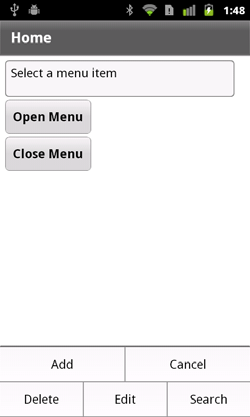

# Define menus in a mobile application

The
[ViewMenu](https://help.adobe.com/en_US/FlashPlatform/reference/actionscript/3/spark/components/ViewMenu.html)
container defines a menu at the bottom of a
[View](https://help.adobe.com/en_US/FlashPlatform/reference/actionscript/3/spark/components/View.html)
container in a mobile application. Each View container defines its own menu
specific to that view.

## Adobe recommends

> ###  [Defining a ViewMenu container for a mobile application](https://www.youtube.com/watch?v=1_DkiuNLNm8)
>
> [Brent Arnold](https://web.archive.org/web/20170816101247/http://www.tutorialsbyibrent.com/)
>
> Learn how to define a ViewMenu container and see how the menu appears on an
> Android device

> ###  [Using a ViewMenu container with custom skins](https://web.archive.org/web/20160420160353/http://devgirl.org/2011/05/04/using-menus-in-your-flex-4-5-mobile-application/)
>
> [Holly Schinsky](https://web.archive.org/web/20160420160353/http://devgirl.org/)
>
> Learn how to define custom skins for a ViewMenu container

The following figure shows the ViewMenu container in an application:

The ViewMenu container defines a menu with a single hierarchy of menu buttons.
That is, you cannot create menus with submenus.

The children of the ViewMenu container are defined as
[ViewMenuItem](https://help.adobe.com/en_US/FlashPlatform/reference/actionscript/3/spark/components/ViewMenuItem.html)
controls. Each ViewMenuItem control represents a single button in the menu.

## User interaction with the ViewMenu container

Open the menu by using the hardware menu key on the mobile device. You can also
open it programmatically.

Selecting a menu button closes the entire menu. The ViewMenuItem control
dispatches a `click` event when the user selects a menu button.

While the menu is open, press the device's back or menu button to close the
menu. The menu also closes if you press the screen anywhere outside the menu.

The caret is the menu button that currently has focus. Use the device's five-way
control or arrow keys to change the caret. Press the device's Enter key or the
five-way control to select the caret item and close the menu.

## Create a menu in a mobile application

Use the `View.viewMenuItems` property to define the menu for a view. The
`View.viewMenuItems` property takes a Vector of ViewMenuItem controls, as the
following example shows:

    <?xml version="1.0" encoding="utf-8"?>
    <!-- components\mobile\views\ViewMenuHome.mxml -->
    <s:View xmlns:fx="http://ns.adobe.com/mxml/2009"
    	xmlns:s="library://ns.adobe.com/flex/spark"
    	title="Home">

    	<fx:Script>
    		<![CDATA[
    			// The event listener for the click event.
    			private function itemClickInfo(event:MouseEvent):void {
    				switch (event.currentTarget.label) {
    					case "Add" :
    						myTA.text = "Add selected";
    						break;
    					case "Cancel" :
    						myTA.text = "Cancel selected";
    						break;
    					case "Delete" :
    						myTA.text = "Delete selected";
    						break;
    					case "Edit" :
    						myTA.text = "Edit selected";
    						break;
    					case "Search" :
    						myTA.text = "Search selected";
    						break;
    					default :
    						myTA.text = "Error";
    				}
    			}
    		]]>
    	</fx:Script>

    	<s:viewMenuItems>
    		<s:ViewMenuItem label="Add" click="itemClickInfo(event);"/>
    		<s:ViewMenuItem label="Cancel" click="itemClickInfo(event);"/>
    		<s:ViewMenuItem label="Delete" click="itemClickInfo(event);"/>
    		<s:ViewMenuItem label="Edit" click="itemClickInfo(event);"/>
    		<s:ViewMenuItem label="Search" click="itemClickInfo(event);"/>
    	</s:viewMenuItems>

    	<s:VGroup paddingTop="10" paddingLeft="10">
    		<s:TextArea id="myTA" text="Select a menu item"/>
    		<s:Button label="Open Menu"
    			click="mx.core.FlexGlobals.topLevelApplication.viewMenuOpen=true;"/>
    		<s:Button label="Close Menu"
    			click="mx.core.FlexGlobals.topLevelApplication.viewMenuOpen=false;"/>
    	</s:VGroup>
    </s:View>

In this example, you use the `View.viewMenuItems` property to add five menu
items, where each menu items represented by a ViewMenuItem control. Each
ViewMenuItem control uses the `label` property to specify the text that appears
in the menu for that item.

Notice that you do not explicitly define the ViewMenu container. The View
container automatically creates an instance of the ViewMenu container to hold
the ViewMenuItem controls.

**Use the ViewMenuItem control's `icon` style**

The ViewMenuItem control defines the `icon` style property that you can use to
include an image. You can use the `icon` style with or without the `label`
property.

**Handle the ViewMenuItem control's `click` event**

Each ViewMenuItem control also defines an event handler for the `click` event.
The ViewMenuItem control dispatches the `click` event when the user selects the
item. In this example, all menu items use the same event handler. However, you
can choose to define a separate event handler for each `click` event.

**Open the ViewMenuItem control programmatically**

You open the menu by using the hardware menu key on your device. This
application also defines two Button controls to open and close the menu
programmatically.

To open the menu programmatically, set the `viewMenuOpen` property of the
application container to `true`. To close the menu, set the property to `false`.
The `viewMenuOpen` property is defined in the
[ViewNavigatorApplicationBase](https://help.adobe.com/en_US/FlashPlatform/reference/actionscript/3/spark/components/supportClasses/ViewNavigatorApplicationBase.html)
class, the base class of the ViewNavigatorApplication and
TabbedViewNavigatorApplication containers.

## Apply a skin to the ViewMenu and ViewMenuItem components

Use skins to control the appearance of the ViewMenu and ViewMenuItem components.
The default ViewMenu skin class is
[spark.skins.mobile.ViewMenuSkin](https://help.adobe.com/en_US/FlashPlatform/reference/actionscript/3/spark/skins/mobile/ViewMenuSkin.html).
The default ViewMenuItem skin class is
[spark.skins.mobile.ViewMenuItemSkin](https://help.adobe.com/en_US/FlashPlatform/reference/actionscript/3/spark/skins/mobile/ViewMenuItemSkin.html).

 Blogger Daniel Demmel
[shows how to skin the ViewMenu control to look like Gingerbread black](https://web.archive.org/web/20141129042323mp_/http://daaain.posterous.com/reskinning-the-android-contextual-menu-viewme).

The skin classes use skin states, such as normal, closed, and disabled, to
control the appearance of the skin. The skins also define transitions to control
the appearance of the menu as it changes view state.

For more information, see
[Basics of mobile skinning](../skinning/basics-of-mobile-skinning.md).

## Set the layout of a ViewMenu container

The
[ViewMenuLayout](https://help.adobe.com/en_US/FlashPlatform/reference/actionscript/3/spark/layouts/ViewMenuLayout.html)
class defines the layout of the view menu. The menu can have multiple rows
depending on the number of menu items.

**ViewMenuItem layout rules**

The `requestedMaxColumnCount` property of the ViewMenuLayout class defines the
maximum number of menu items in a row. By default, the `requestedMaxColumnCount`
property is set to three.

The following rules define how the ViewMenuLayout class performs the layout:

- If you define three or fewer menu items, where the `requestedMaxColumnCount`
  property contains the default value of three, the menu items are displayed in
  a single row. Each menu item has the same size.

  If you define four or more menu items, meaning more menu items than specified
  by the `requestedMaxColumnCount` property, the ViewMenu container creates
  multiple rows.

- If the number of menu items is evenly divisible by the
  `requestedMaxColumnCount` property, each row contains the same number of menu
  items. Each menu item is the same size.

  For example, the `requestedMaxColumnCount` property is set to the default
  value of three, and you define six menu items. The menu displays two rows,
  each containing three menu items.

- If the number of menu items is not evenly divisible by the
  `requestedMaxColumnCount` property, rows can contain a different number of
  menu items. The size of the menu items depends on the number of menu items in
  the row.

  For example, the `requestedMaxColumnCount` property is set to the default
  value of three, and you define eight menu items. The menu displays three rows.
  The first row contains two menu items. The second and third rows each contain
  three items.

**Create a custom ViewMenuItem layout**

The ViewMenuLayout class contains properties to let you modify the gaps between
menu items and the default number of menu items in each row. You can also create
your own custom layout for the menu by creating your own layout class.

By default, the
[spark.skins.mobile.ViewMenuSkin](https://help.adobe.com/en_US/FlashPlatform/reference/actionscript/3/spark/skins/mobile/ViewMenuSkin.html)
class defines the skin for the ViewMenu container. To apply a customized
ViewMenuLayout class to the ViewMenu container, define a new skin class for the
ViewMenu container.

The default ViewMenuSkin class includes a definition for a Group container named
`contentGroup`, as the following example shows:

    ...
    	<s:Group id="contentGroup" left="0" right="0" top="3" bottom="2"
    		minWidth="0" minHeight="0">
    		<s:layout>
    			<s:ViewMenuLayout horizontalGap="2" verticalGap="2" id="contentGroupLayout"
    				requestedMaxColumnCount="3"
    				requestedMaxColumnCount.landscapeGroup="6"/>
    		</s:layout>
    	</s:Group>
    ...

Your skin class must also define a container named `contentGroup`. That
container uses the `layout` property to specify your customized layout class.

You can then apply your custom skin class in the application, as the following
example shows:

    <?xml version="1.0" encoding="utf-8"?>
    <!-- components\mobile\ViewMenuSkin.mxml -->
    <s:ViewNavigatorApplication xmlns:fx="http://ns.adobe.com/mxml/2009"
    	xmlns:s="library://ns.adobe.com/flex/spark"
    	firstView="views.ViewMenuHome">

    	<fx:Style>
    		@namespace s "library://ns.adobe.com/flex/spark";
    		s|ViewMenu {
    			skinClass: ClassReference("skins.MyVMSkin");
    		}

    	</fx:Style>
    </s:ViewNavigatorApplication>
