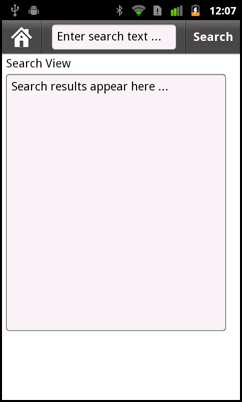

# Define navigation, title, and action controls in a mobile application

## Configure the ActionBar control

The
[ViewNavigator](https://help.adobe.com/en_US/FlashPlatform/reference/actionscript/3/spark/components/ViewNavigator.html)
container defines the
[ActionBar](https://help.adobe.com/en_US/FlashPlatform/reference/actionscript/3/spark/components/ActionBar.html)
control. The ActionBar control provides a standard area for a title, and for
navigation and action controls. It lets you define global controls that users
can access from anywhere in the application, or in a specific view. For example,
you can use the ActionBar control to add a home button, a search button, or
other options.

<table>
<colgroup>
<col style="width: 100%" />
</colgroup>
<tbody>
<tr class="odd">
<td><table>
<colgroup>
<col style="width: 33%" />
<col style="width: 33%" />
<col style="width: 33%" />
</colgroup>
<tbody>
<tr class="odd">
<td colspan="3"><h2 id="adobe-recommends">Adobe recommends</h2></td>
</tr>
<tr class="even">
<td width="60%">

</td>
<td colspan="2"><table>
<colgroup>
<col style="width: 50%" />
<col style="width: 50%" />
</colgroup>
<tbody>
<tr class="odd">
<td width="15%"></td>
<td width="85%"><h3
id="define-navigation-and-action-controls-in-your-application"><a
href="https://www.youtube.com/watch?v=fV85ndnoCA8">Define
navigation and action controls in your application</a></h3>
Brent Arnold 
Learn how to define the ActionBar control and other navigation
controls in your application</td>
</tr>
<tr class="even">
<td colspan="2"><h3 id="have-a-tutorial-you-would-like-to-share"><a
href="https://web.archive.org/web/20150315001716mp_/http://www.adobe.com/community/publishing/download.html">Have
a tutorial you would like to share?</a></h3></td>
</tr>
</tbody>
</table></td>
</tr>
</tbody>
</table></td>
</tr>
</tbody>
</table>

<table>
<colgroup>
<col style="width: 25%" />
<col style="width: 25%" />
<col style="width: 25%" />
<col style="width: 25%" />
</colgroup>
<tbody>
<tr class="odd">
<td colspan="2"><h2 id="adobe-recommends-1">Adobe recommends</h2></td>
<td colspan="2"><h3 id="have-a-tutorial-you-would-like-to-share-1"><a
href="https://web.archive.org/web/20150315001716mp_/http://www.adobe.com/community/publishing/download.html">Have
a tutorial you would like to share?</a></h3></td>
</tr>
<tr class="even">
<td colspan="4" height="10"></td>
</tr>
<tr class="odd">
<td width="5%"></td>
<td width="45%"><h3
id="flex-mobile-development-skinning-the-actionbar-component"><a
href="https://web.archive.org/web/20150315001716mp_/http://corlan.org/2011/08/29/flex-mobile-development-skinning-the-actionbar-component/">Flex
Mobile Development: skinning the ActionBar component</a></h3>
Mihai Corlan 
Describes how to style and skin the ActionBar.</td>
<td width="5%"></td>
<td width="45%"><h3
id="flex-mobile-development-tips-and-tricks-part-2-styling-your-applications-tabs-and-actionbar"><a
href="https://web.archive.org/web/20150315001716mp_/http://www.adobe.com/devnet/flex/articles/flex-mobile-development-tips-tricks-pt2.html">Flex
mobile development tips and tricks – Part 2: Styling your application's
tabs and ActionBar</a></h3>
Holly Schinsky 
Describes styling the ActionBar and tab components in your mobile
application.</td>
</tr>
</tbody>
</table>

For a mobile application with a single section, meaning a single ViewNavigator
container, all views share the same action bar. For a mobile application with
multiple sections, meaning one with multiple ViewNavigator containers, each
section defines its own action bar.

Use the ActionBar control to define the action bar area. The ActionBar control
defines three distinct areas, as the following figure shows:

<i>Image Missing: fmc_action_bar_fmc.png</i>

**A**. Navigation area **B**. Title area **C**. Action area

**Areas of the ActionBar**

- **Navigation area**

  Contains components that let the user navigate the section. For example, you
  can define a home button in the navigation area.

  Use the `navigationContent` property to define the components that appear in
  the navigation area. Use the `navigationLayout` property to define the layout
  of the navigation area.

- **Title area**

  Contains either a String containing title text, or components. If you specify
  components, you cannot specify a title String.

  Use the `title` property to specify the String to appear in the title area.
  Use the `titleContent` property to define the components that appear in the
  title area. Use the `titleLayout` property to define the layout of the title
  area. If you specify a value for the `titleContent` property, the ActionBar
  skin ignores the `title` property.

- **Action area**

  Contains components that define actions the user can take in a view. For
  example, you can define a search or refresh button as part of the action area.

  Use the `actionContent` property to define the components that appear in the
  action area. Use the `actionLayout` property to define the layout of the
  action area.

While Adobe recommends that you use the navigation, title, and action areas as
described, there are no restrictions on the components you place in these areas.

**Set ActionBar properties in the ViewNavigatorApplication, ViewNavigator, or
View container**

You can set the properties that define the contents of the ActionBar control in
the
[ViewNavigatorApplication](https://help.adobe.com/en_US/FlashPlatform/reference/actionscript/3/spark/components/ViewNavigatorApplication.html)
container, in the ViewNavigator container, or in individual View containers. The
View container has the highest priority, followed by the ViewNavigator, then the
ViewNavigatorApplication container. Therefore, the properties that you set in
the ViewNavigatorApplication container apply to the entire application, but you
can override them in the ViewNavigator or View container.

> **Note:** An ActionBar control is associated with a ViewNavigator, so it is
> specific to a single section of a mobile application. Therefore, you cannot
> configure an ActionBar from the TabbedViewNavigatorApplication and
> TabbedViewNavigator containers.

## Example: Customize a Spark ActionBar control at the application level

The following example shows main application file of a mobile application:

    <?xml version="1.0" encoding="utf-8"?>
    <!-- containers\mobile\SparkActionBarSimple.mxml -->
    <s:ViewNavigatorApplication xmlns:fx="http://ns.adobe.com/mxml/2009"
        xmlns:s="library://ns.adobe.com/flex/spark"
        firstView="views.MobileViewHome">

        <fx:Script>
            <![CDATA[
                protected function button1_clickHandler(event:MouseEvent):void {
                    // Perform a refresh
                }
            ]]>
        </fx:Script>

        <s:navigationContent>
            <s:Button label="Home" click="navigator.popToFirstView();"/>
        </s:navigationContent>

        <s:actionContent>
            <s:Button label="Refresh" click="button1_clickHandler(event);"/>
        </s:actionContent>
    </s:ViewNavigatorApplication>

This example defines a Home button in the navigation content area of the
ActionBar control, and a Refresh button in the action content area.

The following example defines the MobileViewHome View container that defines the
first view of the application. The View container defines a title string, "Home
View", but does not override either the navigation content or action content
areas of the ActionBar control:

    <?xml version="1.0" encoding="utf-8"?>
    <!-- containers\mobile\views\MobileViewHome.mxml -->
    <s:View xmlns:fx="http://ns.adobe.com/mxml/2009"
        xmlns:s="library://ns.adobe.com/flex/spark"
        title="Home View">
        <s:layout>
            <s:VerticalLayout paddingTop="10"/>
        </s:layout>

        <s:Label text="Home View"/>
        <s:Button label="Submit"/>
    </s:View>

## Example: Customize an ActionBar control in a View container

This example uses a main application file with a single section that defines a
Home button in the navigation area of the ViewNavigatorApplication container. It
also defines a Search button in the action area:

    <?xml version="1.0" encoding="utf-8"?>
    <!-- containers\mobile\SparkActionBarOverride.mxml -->
    <s:ViewNavigatorApplication xmlns:fx="http://ns.adobe.com/mxml/2009"
        xmlns:s="library://ns.adobe.com/flex/spark"
        firstView="views.MobileViewHomeOverride">

        <fx:Script>
            <![CDATA[
                protected function button1_clickHandler(event:MouseEvent):void {
                    navigator.popToFirstView();
                }

                protected function button2_clickHandler(event:MouseEvent):void {
                    // Handle search
                }

            ]]>
        </fx:Script>

        <s:navigationContent>
            <s:Button icon="@Embed(source='assets/Home.png')"
                click="button1_clickHandler(event);"/>
        </s:navigationContent>

        <s:actionContent>
            <s:Button icon="@Embed(source='assets/Search.png')"
                click="button2_clickHandler(event);"/>
        </s:actionContent>
    </s:ViewNavigatorApplication>

The first view of this application is the MobileViewHomeOverride view. The
MobileViewHomeOverride view defines a Button control to navigate to a second
View container that defines a Search page:

    <?xml version="1.0" encoding="utf-8"?>
    <!-- containers\mobile\views\MobileViewHomeOverride.mxml -->
    <s:View xmlns:fx="http://ns.adobe.com/mxml/2009"
        xmlns:s="library://ns.adobe.com/flex/spark"
        title="Home View">
        <s:layout>
            <s:VerticalLayout paddingTop="10"/>
        </s:layout>

        <fx:Script>
            <![CDATA[

                // Navigate to the Search view.
                protected function button1_clickHandler(event:MouseEvent):void {
                    navigator.pushView(SearchViewOverride);
                }
            ]]>
        </fx:Script>

        <s:Label text="Home View"/>
        <s:Button label="Search" click="button1_clickHandler(event)"/>
    </s:View>

The View container that defines the Search page overrides the title area and
action area of the ActionBar control, as shown below:

    <?xml version="1.0" encoding="utf-8"?>
    <!-- containers\mobile\views\SearchViewOverride.mxml -->
    <s:View xmlns:fx="http://ns.adobe.com/mxml/2009"
        xmlns:s="library://ns.adobe.com/flex/spark">
        <s:layout>
            <s:VerticalLayout paddingTop="10"
                paddingLeft="10" paddingRight="10"/>
        </s:layout>

        <fx:Script>
            <![CDATA[
                protected function button1_clickHandler(event:MouseEvent):void {
                    // Perform a search.
                }
            ]]>
        </fx:Script>

        <!-- Override the title to insert a TextInput control. -->
        <s:titleContent>
            <s:TextInput text="Enter search text ..." textAlpha="0.5"
                width="250"/>
        </s:titleContent>

        <!-- Override the action area to insert a Search button. -->
        <s:actionContent>
            <s:Button label="Search" click="button1_clickHandler(event);"/>
        </s:actionContent>

        <s:Label text="Search View"/>
        <s:TextArea text="Search results appear here ..."
            height="75%"/>
    </s:View>

The following figure shows the ActionBar control for this view:

Because the Search view does not override the navigation area of the ActionBar
control, the navigation area still displays the Home button.

## Hide the ActionBar control

You can hide the ActionBar control in any view by setting the
`View.actionBarVisible` property to `false`. By default, the `actionBarVisible`
property is `true` to show the ActionBar control.

Use the `ViewNavigator.hideActionBar()` method to hide the ActionBar control for
all views controlled by the ViewNavigator, as the following example shows:

    <?xml version="1.0" encoding="utf-8"?>
    <!-- containers\mobile\SparkSingleSectionNoAB.mxml -->
    <s:ViewNavigatorApplication xmlns:fx="http://ns.adobe.com/mxml/2009"
        xmlns:s="library://ns.adobe.com/flex/spark"
        firstView="views.HomeView"
        creationComplete="creationCompleteHandler(event);">

        <fx:Script>
            <![CDATA[
                import mx.events.FlexEvent;

                protected function creationCompleteHandler(event:FlexEvent):void {
                    // Access the ViewNavigator using the ViewNavigatorApplication.navigator property.
                    navigator.hideActionBar();
                }
            ]]>
        </fx:Script>

    </s:ViewNavigatorApplication>

You can define a custom effect for the ActionBar when the ActionBar is hidden,
or when it is made visible. By default, the ActionBar uses the Animate effect on
a show or hide. Change the default effect by overriding the
`ViewNavigator.createActionBarHideEffect()` and
`ViewNavigator.createActionBarShowEffect()` methods. After playing an effect
that hides the ActionBar, set its `visible` and `includeInLayout` properties to
`false` so that it is no longer included in the layout of the view.
