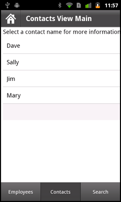

# Define tabs in a mobile application

## Adobe recommends

> ###  [Enable Scrolling in the tab bar of a TabbedViewNavigator](https://web.archive.org/web/20150219043719mp_/http://flexponential.com/2011/10/23/enable-scrolling-in-the-tab-bar-of-a-tabbedviewnavigator/)
>
> [Steven Shongrunden](https://web.archive.org/web/20150219043719mp_/http://flexponential.com/)
> The default tab bar in a TabbedViewNavigator sizes its buttons to fit them all
> onto the screen at once, truncating when necessary. This post shows how to
> create a custom skin that allows horizontal scrolling to reveal buttons off
> screen.

## Define the sections of an application

Use the
[TabbedViewNavigatorApplication](https://help.adobe.com/en_US/FlashPlatform/reference/actionscript/3/spark/components/TabbedViewNavigatorApplication.html)
container to define a mobile application with multiple sections. The
TabbedViewNavigatorApplication container automatically creates a
TabbedViewNavigator container. The TabbedViewNavigator container creates a tab
bar to support navigation among the sections of the application.

Each
[ViewNavigator](https://help.adobe.com/en_US/FlashPlatform/reference/actionscript/3/spark/components/ViewNavigator.html)
container defines a different section of the application. Use the `navigators`
property of the TabbedViewNavigatorApplication container to specify
ViewNavigator containers.

In the following example, you define three sections corresponding to the three
ViewNavigator tags. Each ViewNavigator defines the first view that appears when
you switch to the section:

    <?xml version="1.0" encoding="utf-8"?>
    <!-- containers\mobile\SparkMultipleSections.mxml -->
    <s:TabbedViewNavigatorApplication xmlns:fx="http://ns.adobe.com/mxml/2009"
        xmlns:s="library://ns.adobe.com/flex/spark">

        <s:navigators>
            <s:ViewNavigator label="Employees" firstView="views.EmployeeMainView"/>
            <s:ViewNavigator label="Contacts" firstView="views.ContactsMainView"/>
            <s:ViewNavigator label="Search" firstView="views.SearchView"/>
        </s:navigators>

    </s:TabbedViewNavigatorApplication>

> **Note:** You do not have to specify the `navigators` child tag in MXML
> because it is the default property of TabbedViewNavigator.

Each ViewNavigator maintains a separate navigation stack. Therefore, the
ViewNavigator methods, such as `pushView()` and `popView()`, are relative to the
currently active section. The back button on the mobile device returns control
to the previous view on the stack of the current ViewNavigator. The change of
view does not alter the current section.

You do not have to add any specific logic to the application for section
navigation. The TabbedViewNavigator container automatically creates a tab bar at
the bottom of the application to control the navigation of the sections.

While it is not required, you can add programmatic control of the current
section. To change sections programmatically, set the
`TabbedViewNavigator.selectedIndex` property to the index of the desired
section. Section indexes are 0-based: the first section in the application is at
index 0, the second is at index 1, and so on.

 Adobe Certified Expert in Flex, Brent Arnold, created
[a video about using the ViewNavigator navigation stack](https://www.youtube.com/watch?v=TpJIrkgvqzI).

 Adobe Evangelist Holly Schinsky describes ways to pass
data between tabs in a mobile application in
[Flex Mobile Development - Passing Data Between Tabs](https://web.archive.org/web/20150219043719mp_/http://devgirl.org/2011/08/09/flex-mobile-development-passing-data-between-tabs-part-1-includes-source/).

 See a video about the TabbedViewNavigator container from
video2brain at
[Creating a Tabbed View Navigator Application](https://web.archive.org/web/20150219043719mp_/http://www.video2brain.com/en/videos-5839.htm).

## Adobe recommends

> ###  [Tabbed Applications with Effects onTab Change](https://web.archive.org/web/20150219043719mp_/http://devgirl.org/2011/08/22/flex-mobile-development-tabbed-applications-with-effects-on-tab-change/)
>
> [Holly Schinsky](https://web.archive.org/web/20160421170838/http://devgirl.org/)
>
> Describes how to apply effects when changing tabs in a TabbedViewNavigator.

## Handle section change events

When the section changes, the TabbedViewNavigator container dispatches the
following events:

- The `changing` event is dispatched just before the section changes. To prevent
  the section change, call the `preventDefault()` method in the event handler
  for the `changing` event.

- The `change` event is dispatched just after the section changes.

## Configure the ActionBar with multiple sections

An
[ActionBar](https://help.adobe.com/en_US/FlashPlatform/reference/actionscript/3/spark/components/ActionBar.html)
control is associated with a ViewNavigator. Therefore, you can configure the
ActionBar for each section when you define the section's ViewNavigator. In the
following example, you configure the ActionBar separately for each ViewNavigator
container that defines the three different sections of the application:

    <?xml version="1.0" encoding="utf-8"?>
    <!-- containers\mobile\SparkMultipleSectionsAB.mxml -->
    <s:TabbedViewNavigatorApplication xmlns:fx="http://ns.adobe.com/mxml/2009"
        xmlns:s="library://ns.adobe.com/flex/spark">

        <fx:Script>
            <![CDATA[
                protected function button1_clickHandler(event:MouseEvent):void {
                    // Switch to the first section in the application.
                    tabbedNavigator.selectedIndex = 0;
                    // Switch to the first view in the section.
                    ViewNavigator(tabbedNavigator.selectedNavigator).popToFirstView();
                }
            ]]>
        </fx:Script>

        <s:navigators>
            <s:ViewNavigator label="Employees" firstView="views.EmployeeMainView">
                <s:navigationContent>
                    <s:Button icon="@Embed(source='assets/Home.png')"
                        click="button1_clickHandler(event)"/>
                </s:navigationContent>
            </s:ViewNavigator>
            <s:ViewNavigator label="Contacts" firstView="views.ContactsMainView">
                <s:navigationContent>
                    <s:Button icon="@Embed(source='assets/Home.png')"
                        click="button1_clickHandler(event)"/>
                </s:navigationContent>
            </s:ViewNavigator>
            <s:ViewNavigator label="Search" firstView="views.SearchView">
                <s:navigationContent>
                    <s:Button icon="@Embed(source='assets/Home.png')"
                        click="button1_clickHandler(event)"/>
                </s:navigationContent>
            </s:ViewNavigator>
        </s:navigators>

    </s:TabbedViewNavigatorApplication>

The following figure shows this application with the Contacts tab selected in
the tab bar:

Alternatively, you can define the ActionBar in each view of the application. In
that way, each view uses the same ActionBar content no matter where you use it
in the application.

## Control the tab bar

### Hide the tab bar control in a view

Any view can hide the tab bar by setting the `View.tabBarVisible` property to
`false`. By default, the `tabBarVisible` property is `true` to show the tab bar.

You can also use the `TabbedViewNavigator.hideTabBar()` and
`TabbedViewNavigator.showTabBar()` methods to control the visibility.

 Adobe Certified Expert in Flex, Brent Arnold,
[created a video about hiding the tab bar](https://www.youtube.com/watch?v=WWEOlmRfznM).

### Apply an effect to the tab bar of the TabbedViewNavigator container

By default, the tab bar uses a slide effect for its show and hide effects. The
tab bar does not use any effect when you change the currently selected tab.

You can change the default effect of the tab bar for a show or a hide effect by
overriding the `TabbedViewNavigator.createTabBarHideEffect()` and
`TabbedViewNavigator.createTabBarShowEffect()` methods. After you hide the tab
bar, remember to set the `visible` and `includeInLayout` properties of the tab
bar to `false`.
