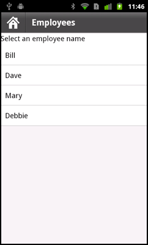
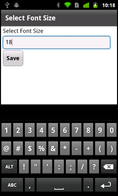

# Define views in a mobile application

A mobile application typically defines multiple screens, or views. As users
navigate through the application, they switch to and from different views.

Make navigation intuitive to the user of your application. That is, when the
user moves from one view to another, they expect to be able to navigate back to
the previous view. The application can define a Home button, or other top-level
navigation aids that let the user move to locations in the application from any
other location.

To define the views of a mobile application, use the
[View](https://help.adobe.com/en_US/FlashPlatform/reference/actionscript/3/spark/components/View.html)
container. To control the navigation among the views of a mobile application,
use the
[ViewNavigator](https://help.adobe.com/en_US/FlashPlatform/reference/actionscript/3/spark/components/ViewNavigator.html)
container.

<table>
<colgroup>
<col style="width: 100%" />
</colgroup>
<tbody>
<tr class="odd">
<td><table>
<colgroup>
<col style="width: 33%" />
<col style="width: 33%" />
<col style="width: 33%" />
</colgroup>
<tbody>
<tr class="odd">
<td colspan="3"><h2 id="adobe-recommends">Adobe recommends</h2></td>
</tr>
<tr class="even">
<td width="60%">

&#10;

<a
href="http://vimeo.com/22138436">Mobile
application development in Flash Builder 4.5</a> from <a
href="https://web.archive.org/web/20150219043729mp_/http://vimeo.com/peterelst">Peter
Elst</a> on <a
href="https://web.archive.org/web/20150219043729mp_/http://vimeo.com/">Vimeo</a>.
</td>
<td colspan="2"><table>
<colgroup>
<col style="width: 50%" />
<col style="width: 50%" />
</colgroup>
<tbody>
<tr class="odd">
<td width="15%"></td>
<td width="85%"><h3
id="create-a-mobile-application-with-multiple-views"><a
href="http://vimeo.com/22138436">Create
a mobile application with multiple views</a></h3>
Peter Elst  
Learn how to create a data-driven Flex mobile application with
multiple views </td>
</tr>
<tr class="even">
<td colspan="2"><h3 id="have-a-tutorial-you-would-like-to-share"><a
href="https://web.archive.org/web/20150219043729mp_/http://www.adobe.com/community/publishing/download.html">Have
a tutorial you would like to share?</a></h3></td>
</tr>
</tbody>
</table></td>
</tr>
</tbody>
</table></td>
</tr>
</tbody>
</table>

<table>
<colgroup>
<col style="width: 25%" />
<col style="width: 25%" />
<col style="width: 25%" />
<col style="width: 25%" />
</colgroup>
<tbody>
<tr class="odd">
<td colspan="2"><h2 id="adobe-recommends-1">Adobe recommends</h2></td>
<td colspan="2"><h3 id="have-a-tutorial-you-would-like-to-share-1"><a
href="https://web.archive.org/web/20150219043729mp_/http://www.adobe.com/community/publishing/download.html">Have
a tutorial you would like to share?</a></h3></td>
</tr>
<tr class="even">
<td colspan="4" height="10"></td>
</tr>
<tr class="odd">
<td width="5%"></td>
<td width="45%"><h3 id="handling-data-while-switching-between-views"><a
href="https://web.archive.org/web/20130817134922/http://devgirl.org/2011/05/18/flex-4-5-mobile-data-handling/">Handling
data while switching between views</a></h3>
Holly Schinsky  
Learn how to handle data while navigating between views in your
mobile application</td>
<td width="5%"></td>
<td width="45%"><h3
id="adobe-flex-mobile-applications-passing-data-between-views"><a
href="https://web.archive.org/web/20150219043729mp_/http://www.uibuzz.com/2011/adobe/adobe-flex-mobile-applications-passing-data-between-views/">Adobe
Flex Mobile applications – passing data between views</a></h3>
Peter Witham 
A video that shows how simple and quick it is to pass data between
views.</td>
</tr>
</tbody>
</table>

## Use pushView() to change views

Use the `ViewNavigator.pushView()` method to push a new view onto the stack.
Access the ViewNavigator by using the `ViewNavigatorApplication.navigator`
property. Pushing a view changes the display of the application to the new view.

The `pushView()` method has the following syntax:

    pushView(viewClass:Class,
    	data:Object = null,
    	context:Object = null,
    	transition:spark.transitions:ViewTransitionBase = null):void

where:

- `viewClass` specifies the class name of the view. This class typically
  corresponds to the MXML file that defines the view.

- `data` specifies any data passed to the view. This object is written to the
  `View.data` property of the new view.

- `context` specifies an arbitrary object written to the `ViewNavigator.context`
  property. When the new view is created, it can reference this property and
  perform an action based on this value. For example, the view could display
  data in different ways based on the value of `context`.

- `transition` specifies the transition to play when the view changes to the new
  view. For information on view transitions, see
  [Define transitions in a mobile application](./define-transitions-in-a-mobile-application.md).

**Use the data argument to pass a single Object**

Use the `data` argument to pass a single Object containing any data required by
the new view. The view can then access the object by using the `View.data`
property, as the following example shows:

    <?xml version="1.0" encoding="utf-8"?>
    <!-- containers\mobile\views\EmployeeView.mxml -->
    <s:View xmlns:fx="http://ns.adobe.com/mxml/2009"
    	xmlns:s="library://ns.adobe.com/flex/spark"
    	title="Employee View">
    	<s:layout>
    		<s:VerticalLayout paddingTop="10"/>
    	</s:layout>

    	<s:VGroup>
    		<s:Label text="{data.firstName}"/>
    		<s:Label text="{data.lastName}"/>
    		<s:Label text="{data.companyID}"/>
    	</s:VGroup>
    </s:View>

In this example, the EmployeeView is defined in the EmployeeView.mxml file. This
view uses the `data` property to access the first and last names of an employee,
and to access the employee's ID from the Object that is passed to it.

The `View.data` property is guaranteed to be valid at the time of the `add`
event for the View object. For more information on the life cycle of a View
container, see
[The life cycle of the Spark ViewNavigator and View containers](#the-life-cycle-of-the-spark-viewnavigator-and-view-containers).

**Pass data to the first view in an application**

The `ViewNavigatorApplication.firstView` property and the
`ViewNavigator.firstView` property define the first view in an application. To
pass data to the first view, use the `ViewNavigatorApplication.firstViewData`
property, or the `ViewNavigator.firstViewData` property.

## Pass data to a view

In the following example, you define a mobile application by using the
[ViewNavigatorApplication](https://help.adobe.com/en_US/FlashPlatform/reference/actionscript/3/spark/components/ViewNavigatorApplication.html)
container. The ViewNavigatorApplication container automatically creates a single
instance of the ViewNavigator class that you use to navigate the Views defined
by the application.

    <?xml version="1.0" encoding="utf-8"?>
    <!-- containers\mobile\SparkSingleSection.mxml -->
    <s:ViewNavigatorApplication xmlns:fx="http://ns.adobe.com/mxml/2009"
    	xmlns:s="library://ns.adobe.com/flex/spark"
    		firstView="views.EmployeeMainView">

    	<fx:Script>
    		<![CDATA[
    			protected function button1_clickHandler(event:MouseEvent):void {
    				// Switch to the first view in the section.
    				navigator.popToFirstView();
    			}
    		]]>
    	</fx:Script>

    	<s:navigationContent>
    		<s:Button icon="@Embed(source='assets/Home.png')"
    			click="button1_clickHandler(event)"/>
    	</s:navigationContent>
    </s:ViewNavigatorApplication>

This example defines a Home button in the navigation area of the
[ActionBar](https://help.adobe.com/en_US/FlashPlatform/reference/actionscript/3/spark/components/ActionBar.html)
control. Selecting the Home button pops all views off the stack back to the
first view. The following figure shows this application:

The EmployeeMainView.mxml file defines the first view of the application, as
shown in the following example:

    <?xml version="1.0" encoding="utf-8"?>
    <!-- containers\mobile\views\EmployeeMainView.mxml -->
    <s:View xmlns:fx="http://ns.adobe.com/mxml/2009"
    	xmlns:s="library://ns.adobe.com/flex/spark"
    	title="Employees">
    	<s:layout>
    		<s:VerticalLayout paddingTop="10"/>
    	</s:layout>

    	<fx:Script>
    		<![CDATA[
    			import spark.events.IndexChangeEvent;

    			protected function myList_changeHandler(event:IndexChangeEvent):void {
    				navigator.pushView(views.EmployeeView,myList.selectedItem);
    			}

    		]]>
    	</fx:Script>

    	<s:Label text="Select an employee name"/>
    	<s:List id="myList"
    		width="100%" height="100%"
    		labelField="firstName"
    		change="myList_changeHandler(event)">
    		<s:ArrayCollection>
    			<fx:Object firstName="Bill" lastName="Smith" companyID="11233"/>
    			<fx:Object firstName="Dave" lastName="Jones" companyID="13455"/>
    			<fx:Object firstName="Mary" lastName="Davis" companyID="11543"/>
    			<fx:Object firstName="Debbie" lastName="Cooper" companyID="14266"/>
    		</s:ArrayCollection>
    	</s:List>
    </s:View>

This view defines a
[List](https://help.adobe.com/en_US/FlashPlatform/reference/actionscript/3/spark/components/List.html)
control that lets the user select an employee name. Selecting a name causes the
event handler for the `change` event to push an instance of a different view
onto the stack, named EmployeeView. Pushing an instance of EmployeeView causes
the application to change to the EmployeeView view.

The `pushView()` method in this example takes two arguments: the new view and an
Object that defines the data to pass to the new view. In this example, you pass
the data object corresponding to the currently selected item in the List
control.

The following example shows the definition of EmployeeView:

    <?xml version="1.0" encoding="utf-8"?>
    <!-- containers\mobile\views\EmployeeView.mxml -->
    <s:View xmlns:fx="http://ns.adobe.com/mxml/2009"
    	xmlns:s="library://ns.adobe.com/flex/spark"
    	title="Employee View">
    	<s:layout>
    		<s:VerticalLayout paddingTop="10"/>
    	</s:layout>

    	<s:VGroup>
    		<s:Label text="{data.firstName}"/>
    		<s:Label text="{data.lastName}"/>
    		<s:Label text="{data.companyID}"/>
    	</s:VGroup>
    </s:View>

The EmployeeView displays the three fields from the data provider of the List
control. EmployeeView accesses the data passed to it by using the `View.data`
property.

 Blogger Steve Mathews
[created a cookbook entry on Passing data between Views](https://web.archive.org/web/20150219043729mp_/http://cookbooks.adobe.com/post_Passing_data_between_Views-18854.html).

## Return data from a view

The `ViewNavigator.popView()` method returns control from the current view back
to the previous view on the stack. When the `popView()` method executes, the
current view is destroyed and the previous View on the stack is restored.
Restoring the previous View includes resetting its `data` property from the
stack,

For a complete description of the life cycle of a view, including events
dispatched during creation, see
[The life cycle of the Spark ViewNavigator and View containers](#the-life-cycle-of-the-spark-viewnavigator-and-view-containers).

The new view is restored with the original `data` object at the time it was
deactivated. Therefore, you do not typically use the original `data` object to
pass data back from the old view to the new view. Instead, you override the
`createReturnObject()` method of the old view. The `createReturnObject()` method
returns a single Object.

**Return object type**

The Object returned by the `createReturnObject()` method is written to the
`ViewNavigator.poppedViewReturnedObject` property. The data type of the
`poppedViewReturnedObject` property is ViewReturnObject.

ViewReturnObject defines two properties, `context` and `object`. The `object`
property contains the Object returned by the `createReturnObject()` method. The
`context` property contains the value of the `context` argument that was passed
to the view when the view was pushed onto the navigation stack using
`pushView()`.

The `poppedViewReturnedObject` property is guaranteed to be set in the new view
before the view receives the `add` event. If the
`poppedViewReturnedObject.object` property is null, no data was returned.

**Example: Passing data to a view**

The following example, SelectFont.mxml, shows a view that lets you set a font
size. The override of the `createReturnObject()` method returns the value as a
Number. The `fontSize` field of the `data` property passed in from the previous
view sets the initial value of the TextInput control:

    <?xml version="1.0" encoding="utf-8"?>
    <!-- containers\mobile\views\SelectFont.mxml -->
    <s:View xmlns:fx="http://ns.adobe.com/mxml/2009"
    	xmlns:s="library://ns.adobe.com/flex/spark"
    	title="Select Font Size"
    	add="addHandler(event);">
    	<s:layout>
    		<s:VerticalLayout paddingTop="10"
    			paddingLeft="10" paddingRight="10"/>
    	</s:layout>

    	<fx:Script>
    		<![CDATA[
    			import mx.events.FlexEvent;

    			// Define return Number object.
    			protected var fontSize:Number;

    			// Initialize the return object with the passed in font size.
    			// If you do not set a value,
    			// return this value for the font size.
    			protected function addHandler(event:FlexEvent):void {
    				fontSize = data.fontSize;
    			}

    			// Save the value of the specified font.
    			protected function changeHandler(event:Event):void {
    				fontSize=Number(ns.text);
    				navigator.popView();
    			}

    			// Override createReturnObject() to return the new font size.
    			override public function createReturnObject():Object {
    				return fontSize;
    			}
    		]]>
    	</fx:Script>

    	<s:Label text="Select Font Size"/>
    	<!-- Set the initlial value of the TextInput to the passed fontSize -->
    	<s:TextInput id="ns"
    		text="{data.fontSize}"/>
    	<s:Button label="Save" click="changeHandler(event);"/>
    </s:View>

The following figure shows the view defined by SelectFont.mxml:

The view in the following example, MainFontView.mxml, uses the view defined in
SetFont.mxml. The MainFontView.mxml view defines the following:

- A Button control in the ActionBar to change to the view defined by
  SetFont.mxml.

- An event handler for the `add` event that first determines if the `View.data`
  property is null. If null, the event handler adds the `data.fontSize` field to
  the `View.data` property.

  If the `data` property is not null, the event handler sets the font size to
  the value in the `data.fontSize` field.

    <?xml version="1.0" encoding="utf-8"?>
    <!-- containers\mobile\views\MainFontView.mxml -->

  <s:View xmlns:fx="http://ns.adobe.com/mxml/2009"
  xmlns:s="library://ns.adobe.com/flex/spark" title="Font Size"
  add="addHandler(event);"> <s:layout> <s:VerticalLayout paddingTop="10"/>
  </s:layout>

  <fx:Script> <![CDATA[ import mx.events.FlexEvent;

  // Change to the SelectFont view, and pass the current data property. // The
  data property contains the fontSize field with the current font size.
  protected function clickHandler(event:MouseEvent):void {
  navigator.pushView(views.SelectFont, data); }

  // Set the font size in the event handler for the add event. protected
  function addHandler(event:FlexEvent):void { // If the data property is null,
  // initialize it and create the data.fontSize field. if (data == null) { data
  = new Object(); data.fontSize = getStyle('fontSize'); return; }

  // Otherwise, set data.fontSize to the retured value, // and set the font
  size. data.fontSize = navigator.poppedViewReturnedObject.object;
  setStyle('fontSize', data.fontSize); } ]]> </fx:Script>

  <s:actionContent> <s:Button label="Set Font&gt;"
  click="clickHandler(event);"/> </s:actionContent>

  <s:Label text="Text to size."/> </s:View>

## Configure an application for portrait and landscape orientation

A mobile device sets the orientation of an application automatically when the
device orientation changes. To configure your application for different
orientations, Flex defines two view states that correspond to the portrait and
landscape orientations: `portrait` and `landscape`. Use these view states to set
characteristics of your application based on the orientation.

The following example uses view state to control the `layout` property of a
Group container based on the current orientation:

    <?xml version="1.0" encoding="utf-8"?>
    <!-- containers\mobile\views\SearchViewStates.mxml -->
    <s:View xmlns:fx="http://ns.adobe.com/mxml/2009"
    	xmlns:s="library://ns.adobe.com/flex/spark"
    	title="Search">
    	<s:layout>
    		<s:VerticalLayout paddingTop="10"/>
    	</s:layout>

    	<s:states>
    		<s:State name="portrait"/>
    		<s:State name="landscape"/>
    	</s:states>

    	<s:Group>
    		<s:layout>
    			<s:VerticalLayout/>
    		</s:layout>
    		<s:layout.landscape>
    			<s:HorizontalLayout/>
    		</s:layout.landscape>
    		<s:TextInput text="Enter search text" textAlpha="0.5"/>
    		<s:Button label="Search"/>
    	</s:Group>
    	<s:TextArea text="search results" textAlpha="0.5"/>
    </s:View>

This example defines a search view. The Group container controls the layout of
the input search text and search button. In portrait mode, the Group container
uses vertical layout. Changing the layout to landscape mode causes the Group
container to use horizontal layout.

**Define a custom skin to support layout modes**

You can define a custom skin class for a mobile application. If the skin
supports portrait and landscape layout, your skin must handle the `portrait` and
`landscape` view states.

You can configure an application so that it does not change the layout
orientation as the user rotates the device. To do so, edit the application's XML
file, the one ending in -app.xml, to set the following properties:

- To disable the application from changing the layout orientation, set the
  `<autoOrients>` property to `false`.

- To set the orientation, set the `<aspectRatio>` property to `portrait` or
  `landscape`.

## Set the overlay mode of a Spark ViewNavigator container

By default, the tab bar and ActionBar control of a mobile application define an
area that cannot be used by the views of the application. That means your
content cannot use the full screen size of the mobile device.

However, you can use the `ViewNavigator.overlayControls` property to change the
default layout of these components. When you set the `overlayControls` property
to `true`, the content area of the application spans the entire width and height
of the screen. The ActionBar control and the tab bar hover over the content area
with an alpha value that makes them appear partly transparent.

The skin class for the ViewNavigator container,
spark.skins.mobile.ViewNavigatorSkin, defines view states to handle the
different values of the `overlayControls` property. When the `overlayControls`
property is `true`, "AndOverlay" is appended to the current state's name. For
example, ViewNavigator's skin is in the "portrait" state by default. When the
`overlayControls` property is `true`, the navigator's skin's state is changed to
"portraitAndOverlay".

## The life cycle of the Spark ViewNavigator and View containers

Flex performs a series of operations when you switch from one view to another
view in a mobile application. At various points during the process of switching
views, Flex dispatches events. You can monitor these events to perform actions
during the process. For example, you can use the `removing` event to cancel the
switch from one view to another view.

The following chart describes the process of switching from the current view,
View A, to another view, View B:

