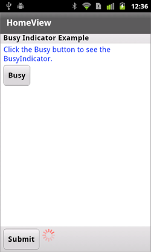

# Display the busy indicator for long-running activity in a mobile application

The Spark
[BusyIndicator](https://help.adobe.com/en_US/FlashPlatform/reference/actionscript/3/spark/components/BusyIndicator.html)
control displays a rotating spinner with 12 spokes. You use the BusyIndicator
control to provide a visual indication that a long-running operation is in
progress.

The following figure shows the BusyIndicator control in the control bar area of
a Spark Panel container, next to the Submit button:

Make the BusyIndicator control visible while a long-running operation is in
progress. When the operation is complete, hide the control.

For example, you can create an instance of the BusyIndicator control in an event
handler, possibly the event handler that starts the long-running process. In the
event handler, call the `addElement()` method to add the control to a container.
When the process is complete, call `removeElement()` to remove the BusyIndicator
control from the container.

Another option is to use the `visible` property of the control to show and hide
it. In the following example, you add the BusyIndicator control to the control
bar area of a Spark Panel container in a View container:

    <?xml version="1.0" encoding="utf-8"?>
    <!-- components\mobile\views\SimpleBusyIndicatorHomeView.mxml -->
    <s:View xmlns:fx="http://ns.adobe.com/mxml/2009"
        xmlns:s="library://ns.adobe.com/flex/spark"
        title="HomeView">

        <s:Panel id="panel" title="Busy Indicator Example"
            width="100%" height="100%">
            <s:controlBarContent>
                <s:Button label="Submit" />
                <s:BusyIndicator id="bi"
                    visible="false"
                    symbolColor="red"/>
            </s:controlBarContent>

            <s:VGroup left="10" right="10" top="10" bottom="10">
                <s:Label width="100%" color="blue"
                    text="Click the Busy button to see the BusyIndicator."/>
                <s:Button label="Busy"
                    click="{bi.visible = !bi.visible}" />
            </s:VGroup>
        </s:Panel>
    </s:View>

In this example, the `visible` property of the BusyIndicator control is
initially set to `false` to hide it. Click the Busy button to set the `visible`
property to `true` to show the control.

The BusyIndicator control only spins when it is visible. Therefore, when you set
the `visible` property to `false`, the control does not require any processing
cycles.

> **Note:** Setting the `visible` property to `false` hides the control, but the
> control is still included in the layout of its parent container. To exclude
> the control from layout, set the `visible` and `includeInLayout` properties to
> `false`.

The Spark BusyIndicator control does not support skinning. However, you can use
styles to set the color and rotation interval of the spinner. In the previous
example, you set the color of the indicator by using the `symbolColor` property.
