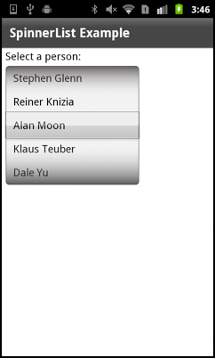
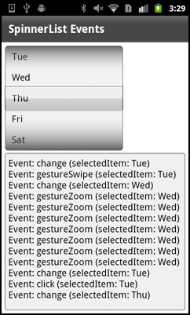
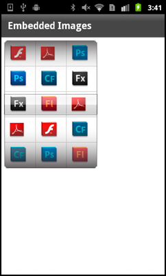

# Use a spinner list in a mobile application

The
[SpinnerList](https://help.adobe.com/en_US/FlashPlatform/reference/actionscript/3/spark/components/SpinnerList.html)
component is a specialized
[List](https://help.adobe.com/en_US/FlashPlatform/reference/actionscript/3/spark/components/List.html)
that is typically used for data selection in mobile applications. By default, as
the user scrolls through the list items, the items wrap after the user reaches
the end of the list. The SpinnerList control is commonly used as a numeric
stepper component in mobile applications.

The following image shows what a typical SpinnerList control looks like in a
mobile application:

SpinnerList control

The SpinnerList behaves like a spinning cylindrical drum. Users can spin the
list by using upward or downward throws, drag it upward or downward, and click
an item in the list.

You typically wrap a SpinnerList control in a
[SpinnerListContainer](https://help.adobe.com/en_US/FlashPlatform/reference/actionscript/3/spark/controls/SpinnerListContainer.html)
control. This class provides most of the chrome for the SpinnerList and defines
the layout. The chrome includes the borders, shadows, and the appearance of the
selection indicator.

The data for a SpinnerList is stored as a list. It is rendered in the spinner
with a SpinnerListItemRenderer. You can override the item renderer to customize
the appearance or contents of the list items.

The
[DateSpinner](https://help.adobe.com/en_US/FlashPlatform/reference/actionscript/3/spark/components/DateSpinner.html)
control is an example of a set of SpinnerList controls with a custom item
renderer.

You cannot currently disable items in a SpinnerList control without disabling
the entire control. This limitation does not apply to the DateSpinner control,
which provides additional logic for setting ranges of disabled dates.

## Define data for a spinner list

To define data for a
[SpinnerList](https://help.adobe.com/en_US/FlashPlatform/reference/actionscript/3/spark/components/SpinnerList.html)
control, you can do one of the following:

- Define the data inline in the SpinnerList control's `dataProvider` property.

- Define data as child tags of the `<s:SpinnerList>` tag.

- Define data in ActionScript or MXML and bind it to the SpinnerList control.
  This data can be from an external service, an embedded resource such as an XML
  file, or any other data source.

- Bind the SpinnerList control to a data service operation with the Flash
  Builder Services Wizard. For more information about building data-centric
  applications with Flash Builder, see
  [Connecting to data services](https://web.archive.org/web/20150217141128mp_/http://help.adobe.com/en_US/flex/accessingdata/WSbde04e3d3e6474c4-668f02f4120d422cf08-7ffe.html).

The SpinnerList control can take any class that implements the
[IList](https://help.adobe.com/en_US/FlashPlatform/reference/actionscript/3/mx/collections/IList.html)
interface as a data provider. These classes include the
[ArrayCollection](https://help.adobe.com/en_US/FlashPlatform/reference/actionscript/3/mx/collections/ArrayCollection.html),
[ArrayList](https://help.adobe.com/en_US/FlashPlatform/reference/actionscript/3/mx/collections/ArrayList.html),
[NumericDataProvider](https://help.adobe.com/en_US/FlashPlatform/reference/actionscript/3/spark/collections/NumericDataProvider.html),
and
[XMLListCollection](https://help.adobe.com/en_US/FlashPlatform/reference/actionscript/3/mx/collections/XMLListCollections.html)
classes.

If you do not define a data provider for the SpinnerList control when it is
instantiated, then the SpinnerList appears with a single empty row. After adding
a data provider, the SpinnerList resizes to show the default of five items in
the list.

The following example defines data for the SpinnerList control in child tags of
the `<s:SpinnerList>` tag:

    <?xml version="1.0" encoding="utf-8"?>
    <!-- mobile_spinnerlist/views/SpinnerListComplexDataProvider.mxml -->
    <s:View xmlns:fx="http://ns.adobe.com/mxml/2009"
    		xmlns:s="library://ns.adobe.com/flex/spark"
    		title="Complex Data Provider">
    	<fx:Declarations>
    		<!-- Place non-visual elements (e.g., services, value objects) here -->
    	</fx:Declarations>

    	<s:layout>
    		<s:VerticalLayout paddingTop="10" paddingLeft="10"/>
    	</s:layout>

    	<s:Label text="Select a person:"/>

    	<s:SpinnerListContainer>
    		<s:SpinnerList id="peopleList" width="200" labelField="name">
    			<s:ArrayList>
    				<fx:Object name="Friedeman Friese" companyID="14266"/>
    				<fx:Object name="Stephen Glenn" companyID="14266"/>
    				<fx:Object name="Reiner Knizia" companyID="11233"/>
    				<fx:Object name="Alan Moon" companyID="11543"/>
    				<fx:Object name="Klaus Teuber" companyID="13455"/>
    				<fx:Object name="Dale Yu" companyID="14266"/>
    			</s:ArrayList>
    		</s:SpinnerList>
    	</s:SpinnerListContainer>

    	<s:Label text="Selected ID: {peopleList.selectedItem.companyID}"/>

    </s:View>

The following example defines SpinnerList data in the `<s:SpinnerList>` tag:

    <?xml version="1.0" encoding="utf-8"?>
    <!-- mobile_spinnerlist/views/SpinnerListInlineDataProvider.mxml -->
    <s:View xmlns:fx="http://ns.adobe.com/mxml/2009"
    		xmlns:s="library://ns.adobe.com/flex/spark"
    		title="Inline Data Provider">
    	<fx:Declarations>
    		<!-- Place non-visual elements (e.g., services, value objects) here -->
    	</fx:Declarations>

    	<s:layout>
    		<s:VerticalLayout paddingTop="10" paddingLeft="10"/>
    	</s:layout>

    	<fx:Script>
    		<![CDATA[
    			import mx.collections.ArrayList;
    		]]>
    	</fx:Script>

    	<s:SpinnerListContainer>
    		<!-- Create data provider inline. -->
    		<s:SpinnerList id="smallList" dataProvider="{new ArrayList([1,5,10,15,30])}"
    					   wrapElements="false" typicalItem="44"/>
    	</s:SpinnerListContainer>

    	<s:Label text="Selected Item: {smallList.selectedItem}"/>

    </s:View>

The following example defines SpinnerList data in ActionScript:

    <?xml version="1.0" encoding="utf-8"?>
    <!-- mobile_spinnerlist/views/SpinnerListBasicDataProvider.mxml -->
    <s:View xmlns:fx="http://ns.adobe.com/mxml/2009"
    		xmlns:s="library://ns.adobe.com/flex/spark"
    		title="Basic Data Provider"
    		creationComplete="initApp()">
    	<fx:Declarations>
    		<!-- Place non-visual elements (e.g., services, value objects) here -->
    	</fx:Declarations>

    	<s:layout>
    		<s:VerticalLayout paddingTop="10" paddingLeft="10"/>
    	</s:layout>

    	<fx:Script>
    		<![CDATA[
    			import mx.collections.ArrayList;

    			[Bindable]
    			public var daysOfWeek:ArrayList;

    			private function initApp():void {
    				daysOfWeek = new ArrayList(["Mon","Tue","Wed","Thu","Fri","Sat","Sun"]);
    			}
    		]]>
    	</fx:Script>

    	<s:SpinnerListContainer>
    		<s:SpinnerList id="daysList" width="100" dataProvider="{daysOfWeek}"/>
    	</s:SpinnerListContainer>

    	<s:Label text="Selected Day: {daysList.selectedItem}"/>

    </s:View>

If you have complex objects as data in ActionScript, you specify the
`labelField` property so that the SpinnerList displays the right labels, as the
following example shows:

    <?xml version="1.0" encoding="utf-8"?>
    <!-- mobile_spinnerlist/views/SpinnerListComplexASDP.mxml -->
    <s:View xmlns:fx="http://ns.adobe.com/mxml/2009"
    		xmlns:s="library://ns.adobe.com/flex/spark"
    		title="Complex Data Provider in AS" creationComplete="initApp()">
    	<fx:Declarations>
    		<!-- Place non-visual elements (e.g., services, value objects) here -->
    	</fx:Declarations>

    	<s:layout>
    		<s:VerticalLayout paddingTop="10" paddingLeft="10"/>
    	</s:layout>

    	<fx:Script>
    		<![CDATA[
    			import mx.collections.ArrayList;

    			[Bindable]
    			private var myAC:ArrayList;

    			private function initApp():void {
    				myAC = new ArrayList([
    					{name:"Alan Moon",id:42},
    					{name:"Friedeman Friese",id:44},
    					{name:"Dale Yu",id:45},
    					{name:"Stephen Glenn",id:47},
    					{name:"Reiner Knizia",id:48},
    					{name:"Klaus Teuber",id:49}
    				]);
    			}
    		]]>
    	</fx:Script>

    	<s:SpinnerListContainer>
    		<s:SpinnerList id="peopleList" dataProvider="{myAC}"
    					   width="200"
    					   labelField="name"/>
    	</s:SpinnerListContainer>
    	<s:Label text="Selected ID: {peopleList.selectedItem.id}"/>
    </s:View>

You can also use a convenience class,
[NumericDataProvider](https://help.adobe.com/en_US/FlashPlatform/reference/actionscript/3/spark/collections/NumericDataProvider.html),
to provide numeric data to a SpinnerList control. This class lets you easily
define a set of numeric data with a minimum value, maximum value, and step size.

The following example uses the NumericDataProvider class as data sources for the
SpinnerList controls:

    <?xml version="1.0" encoding="utf-8"?>
    <!-- mobile_spinnerlist/views/MinMaxSpinnerList.mxml -->
    <s:View xmlns:fx="http://ns.adobe.com/mxml/2009"
    		xmlns:s="library://ns.adobe.com/flex/spark"
    		title="Min/Max SpinnerLists"
    		backgroundColor="0x000000">

    	<fx:Script>
    		<![CDATA[
    			import mx.collections.ArrayList;
    		]]>
    	</fx:Script>

    	<s:SpinnerListContainer top="10" left="10">
    		<s:SpinnerList typicalItem="100">
    			<s:dataProvider>
    				<s:NumericDataProvider minimum="0" maximum="23" stepSize="1"/>
    			</s:dataProvider>
    		</s:SpinnerList>
    		<s:SpinnerList typicalItem="100">
    			<s:dataProvider>
    				<s:NumericDataProvider minimum="0" maximum="59" stepSize="1"/>
    			</s:dataProvider>
    		</s:SpinnerList>
    		<s:SpinnerList typicalItem="100">
    			<s:dataProvider>
    				<s:NumericDataProvider minimum="0" maximum="59" stepSize="1"/>
    			</s:dataProvider>
    		</s:SpinnerList>
    		<s:SpinnerList typicalItem="100"
    					   dataProvider="{new ArrayList(['AM','PM'])}"
    					   wrapElements="false"/>
    	</s:SpinnerListContainer>
    </s:View>

The value of the `stepSize` property can be a negative number. In this case, the
maximum value is the first value displayed. The spinner starts are the maximum
value and steps to the minimum value.

## Select items in a spinner list

The
[SpinnerList](https://help.adobe.com/en_US/FlashPlatform/reference/actionscript/3/spark/components/SpinnerList.html)
control supports selecting only a single item at a time. The selected item is
always in the center of the component and, by default, is displayed under the
selection indicator. When not spinning, the SpinnerList must always have an item
selected. You cannot select a disabled item or a line with no item.

To get the currently selected item in a SpinnerList control, you access the
control's `selectedIndex` or `selectedItem` properties.

To set the currently selected item in a SpinnerList control, you set the value
of the `selectedIndex` or `selectedItem` properties. You typically set these
properties on the `<s:SpinnerList>` tag so that the item is selected when the
SpinnerList is created.

If you do not explicitly set the value of the `selectedIndex` or `selectedItem`
properties on the SpinnerList, the default selected item is the first item in
the list.

You can use the `selectedIndex` or `selectedItem` properties to programmatically
change the selected item in the spinner. When you set one of these properties,
the control snaps to the item; it does not animate (or "spin") the spinner to
the item.

The following example uses the SpinnerList control as a countdown timer. The
Timer object changes the selected item in the spinner by changing the value of
the `selectedIndex` property every second:

    <?xml version="1.0" encoding="utf-8"?>
    <!-- mobile_spinnerlist/views/SpinnerListCountdownTimer.mxml -->
    <s:View xmlns:fx="http://ns.adobe.com/mxml/2009"
    		xmlns:s="library://ns.adobe.com/flex/spark"
    		title="Countdown Timer"
    		creationComplete="initApp()">
    	<fx:Declarations>
    		<!-- Place non-visual elements (e.g., services, value objects) here -->
    	</fx:Declarations>

    	<fx:Script>
    		<![CDATA[
    			private var myTimer:Timer;

    			private function initApp():void {
    				myTimer = new Timer(1000, 0); // 1 second
    				myTimer.addEventListener(TimerEvent.TIMER, changeSpinner);
    				myTimer.start();
    			}
    			private function changeSpinner(e:Event):void {
    				secList.selectedIndex = secList.selectedIndex - 1;
    			}
    		]]>
    	</fx:Script>

    	<s:SpinnerListContainer left="50" top="50">
    		<s:SpinnerList id="secList" width="100" selectedIndex="60">
    			<s:dataProvider>
    				<s:NumericDataProvider minimum="0" maximum="60" stepSize="1"/>
    			</s:dataProvider>
    		</s:SpinnerList>
    	</s:SpinnerListContainer>

    </s:View>

## User interactions and events with a spinner list

When the selected item in a
[SpinnerList](https://help.adobe.com/en_US/FlashPlatform/reference/actionscript/3/spark/components/SpinnerList.html)
control changes, the control dispatches `change` and `valueCommit` events. This
is typically in reaction to user interaction such as a swipe. If a user selects
an item by touching that item, the control dispatches a `click` event as well as
`change` and `valueCommit` events.

When the selected item changes programmatically, the SpinnerList control
dispatches only a `valueCommit` event.

When the SpinnerList control is spinning, it does not dispatch events for each
item it passes. It only dispatches events such as `change` or `valueCommit` when
it comes to rest on a new item.

When the SpinnerList control is first instantiated with a data provider, it
dispatches both the `change` and `valueCommit` events.

The following example shows the common events that are dispatched when using the
SpinnerList control:

    <?xml version="1.0" encoding="utf-8"?>
    <!-- mobile_spinnerlist/views/SpinnerListEvents.mxml -->
    <s:View xmlns:fx="http://ns.adobe.com/mxml/2009"
    		xmlns:s="library://ns.adobe.com/flex/spark"
    		title="SpinnerList Events"
    		creationComplete="initApp()">
    	<s:layout>
    		<s:VerticalLayout paddingTop="10" paddingLeft="10"
    						  paddingRight="10" paddingBottom="10"/>
    	</s:layout>

    	<fx:Script>
    		<![CDATA[
    			import mx.collections.ArrayList;

    			[Bindable]
    			public var daysOfWeek:ArrayList;

    			private function initApp():void {
    				daysOfWeek = new ArrayList(["Mon","Tue","Wed","Thu","Fri","Sat","Sun"]);
    			}

    			private function eventHandler(e:Event):void {
    				ta1.text += "Event: " + e.type + " (selectedItem: " + e.currentTarget.selectedItem + ")\n";
    			}
    		]]>
    	</fx:Script>

    	<s:SpinnerListContainer>
    		<s:SpinnerList id="daysList" width="300"
    			dataProvider="{daysOfWeek}"
    			change="eventHandler(event)"
    			gestureSwipe="eventHandler(event)"
    			click="eventHandler(event)"
    			gestureZoom="eventHandler(event)"
    		/>
    	</s:SpinnerListContainer>
    	<s:TextArea id="ta1" width="100%" height="100%"/>
    </s:View>

The following image shows the output after interacting with the SpinnerList
control:

SpinnerList control events

## Set wrapping on a spinner list

By default, if the number of items in the
[SpinnerList](https://help.adobe.com/en_US/FlashPlatform/reference/actionscript/3/spark/components/SpinnerList.html)
control's data provider is less than the number of items displayed in the
spinner, the spinner does not wrap; it stops at the last item in the list.
Otherwise, the spinner wraps to the beginning of the list when the user goes
past the last item.

The default number of items displayed in the list is five. If you want to change
the number of items, create a custom skin. For more information, see
[Create a custom skin for a spinner list](#create-a-custom-skin-for-a-spinner-list).

The value of the `wrapElements` property determines whether a SpinnerList
control starts again at the first item after the last item in the list is
reached. If `wrapElements` is set to `false`, then the spinner stops when it
reaches the end of the list, regardless of the number of items in the list and
the number of items displayed.

If the `wrapElements` property is set to `true`, then the spinner starts again
with the first item, but only if the list contains at least one more items than
the number of items that can be displayed. For example, if the SpinnerList
displays five items, but there are only four items in the list, the list will
not wrap regardless of the setting of the `wrapElements` property.

You can override the default wrapping behavior of the SpinnerList by setting the
`wrapElements` property to `true` or `false`.

The following example lets you toggle the value of the `wrapElements` property:

    <?xml version="1.0" encoding="utf-8"?>
    <!-- mobile_spinnerlist/views/SpinnerListWrapElements.mxml -->
    <s:View xmlns:fx="http://ns.adobe.com/mxml/2009"
    		xmlns:s="library://ns.adobe.com/flex/spark"
    		title="Wrap Elements">
    	<s:layout>
    		<s:VerticalLayout paddingTop="10" paddingLeft="10"/>
    	</s:layout>

    	<fx:Script>
    		<![CDATA[
    			import mx.collections.ArrayList;
    		]]>
    	</fx:Script>

    	<s:SpinnerListContainer>
    		<s:SpinnerList id="smallList" typicalItem="45"
    					   dataProvider="{new ArrayList([1,5,6,10,15,30])}"
    					   wrapElements="{cb1.selected}"/>
    	</s:SpinnerListContainer>

    	<!-- By default, cause the elements to be wrapped by setting this to true -->
    	<s:CheckBox id="cb1" label="Wrap Elements" selected="true"/>

    </s:View>

In general, users expect the list to wrap if there are more items in the list
than the list displays at one time. If there are fewer items in the list than
the spinner can display, then users typically expect the list to not wrap.

## Set styles on a spinner list

The
[SpinnerList](https://help.adobe.com/en_US/FlashPlatform/reference/actionscript/3/spark/components/SpinnerList.html)
control supports all the text styles common to the Spark mobile theme. These
styles include the `fontSize`, `fontWeight`, `color`, `textDecoration`, and
alignment properties. You can set these style properties directly on the control
in MXML or in CSS. The SpinnerList also inherits these properties if they are
set on a parent container.

You can also define the padding properties of a SpinnerList by modifying the
[SpinnerListItemRenderer](https://help.adobe.com/en_US/FlashPlatform/reference/actionscript/3/spark/components/SpinnerListItemRenderer.html)
style properties.

The following example sets text-related style properties on the SpinnerList type
selector and padding properties on the SpinnerListItemRenderer type selector:

    <?xml version="1.0" encoding="utf-8"?>
    <!-- mobile_spinnerlist/SpinnerListExamples2.mxml -->
    <s:ViewNavigatorApplication xmlns:fx="http://ns.adobe.com/mxml/2009"
    							xmlns:s="library://ns.adobe.com/flex/spark"
    							firstView="views.SpinnerListStyles">
    	<fx:Declarations>
    		<!-- Place non-visual elements (e.g., services, value objects) here -->
    	</fx:Declarations>

    	<fx:Style>
    		@namespace s "library://ns.adobe.com/flex/spark";
    		s|SpinnerList {
    			textAlign: right;
    			fontSize: 13;
    			fontWeight: bold;
    			color: red;
    		}
    		s|SpinnerListItemRenderer {
    			paddingTop: 5;
    			paddingBottom: 5;
    			paddingRight: 5;
    		}
    	</fx:Style>

    </s:ViewNavigatorApplication>

In a mobile application, define the `<fx:Style>` block at the top-level
application file if you use type selectors. Otherwise, the compiler throws a
warning and the styles are not applied.

The SpinnerList control does not support the `accentColor`, `backgroundAlpha`,
`backgroundColor`, or `chromeColor` style properties.

## Create a custom skin for a spinner list

You can create a custom skin for a
[SpinnerList](https://help.adobe.com/en_US/FlashPlatform/reference/actionscript/3/spark/components/SpinnerList.html)
control or for the
[SpinnerListContainer](https://help.adobe.com/en_US/FlashPlatform/reference/actionscript/3/spark/components/SpinnerListContainer.html)
control. To do this, you typically copy the source of the
[SpinnerListSkin](https://help.adobe.com/en_US/FlashPlatform/reference/actionscript/3/spark/skins/mobile/SpinnerListSkin.html)
or
[SpinnerListContainerSkin](https://help.adobe.com/en_US/FlashPlatform/reference/actionscript/3/spark/skins/mobile/SpinnerListContainerSkin.html)
as a basis for your custom skin class.

You typically create custom SpinnerList skins to modify the following aspects of
a SpinnerList control or its container:

- Change the size or shape of the box around the currently selected item
  (`selectionIndicator`). This is done by creating a custom
  SpinnerListContainerSkin class.

- Define the height of each row (`rowHeight`). This is done by creating a custom
  SpinnerListSkin class.

- Define the number of rows displayed (`requestedRowCount`). This is done by
  creating a custom SpinnerListSkin class.

- Define the appearance of the container (such as the corner radius and border
  thickness). This is done by creating a custom SpinnerListContainerSkin class.

For an example of a custom SpinnerListSkin and SpinnerListContainerSkin, see
[Customize the appearance of a DateSpinner control](./select-dates-and-times-in-a-mobile-application.md#customize-the-appearance-of-a-datespinner-control).

## Use images in a spinner list

You can use images in a
[SpinnerList](https://help.adobe.com/en_US/FlashPlatform/reference/actionscript/3/spark/components/SpinnerList.html)
control instead of text labels by defining an
[IconItemRenderer](https://help.adobe.com/en_US/FlashPlatform/reference/actionscript/3/spark/components/IconItemRenderer.html)
as the item renderer for the SpinnerList.

To use images in an IconItemRenderer object, you can either embed them or load
them at runtime. For mobile users, it might be more appropriate to embed them to
minimize data network use.

The following example uses embedded images in a SpinnerList control:

    <?xml version="1.0" encoding="utf-8"?>
    <!-- mobile_spinnerlist/views/SpinnerListEmbeddedImage.mxml -->
    <s:View xmlns:fx="http://ns.adobe.com/mxml/2009"
    		xmlns:s="library://ns.adobe.com/flex/spark"
    		title="Embedded Images">

    	<s:layout>
    		<s:VerticalLayout paddingTop="10" paddingLeft="10"/>
    	</s:layout>

    	<fx:Script>
    		<![CDATA[
    			import mx.collections.ArrayList;

    			[Embed(source="../../assets/product_icons/flex_50x50.gif")]
    			[Bindable]
    			public var icon0:Class;
    			[Embed(source="../../assets/product_icons/acrobat_reader_50x50.gif")]
    			[Bindable]
    			public var icon1:Class;
    			[Embed(source="../../assets/product_icons/coldfusion_50x50.gif")]
    			[Bindable]
    			public var icon2:Class;
    			[Embed(source="../../assets/product_icons/flash_50x50.gif")]
    			[Bindable]
    			public var icon3:Class;
    			[Embed(source="../../assets/product_icons/flash_player_50x50.gif")]
    			[Bindable]
    			public var icon4:Class;
    			[Embed(source="../../assets/product_icons/photoshop_50x50.gif")]
    			[Bindable]
    			public var icon5:Class;

    			// Return an ArrayList of icons for each spinner
    			private function getIconList():ArrayList {
    				var a:ArrayList = new ArrayList();
    				a.addItem({icon:icon0});
    				a.addItem({icon:icon1});
    				a.addItem({icon:icon2});
    				a.addItem({icon:icon3});
    				a.addItem({icon:icon4});
    				a.addItem({icon:icon5});
    				return a;
    			}
    		]]>
    	</fx:Script>

    	<s:SpinnerListContainer>
    		<s:SpinnerList id="productList1" width="90" dataProvider="{getIconList()}" selectedIndex="0">
    			<s:itemRenderer>
    				<fx:Component>
    					<s:IconItemRenderer labelField="" iconField="icon"/>
    				</fx:Component>
    			</s:itemRenderer>
    		</s:SpinnerList>
    		<s:SpinnerList id="productList2" width="90" dataProvider="{getIconList()}" selectedIndex="2">
    			<s:itemRenderer>
    				<fx:Component>
    					<s:IconItemRenderer labelField="" iconField="icon"/>
    				</fx:Component>
    			</s:itemRenderer>
    		</s:SpinnerList>
    		<s:SpinnerList id="productList3" width="90" dataProvider="{getIconList()}" selectedIndex="1">
    			<s:itemRenderer>
    				<fx:Component>
    					<s:IconItemRenderer labelField="" iconField="icon"/>
    				</fx:Component>
    			</s:itemRenderer>
    		</s:SpinnerList>
    	</s:SpinnerListContainer>
    </s:View>

The following image shows how this application appears on a mobile device:

SpinnerList control with embedded images
